# notebook
# TensorFlow基础
## 1. 张量
张量是一个多维数组，与numpy数组类似，具有**数据类型**和**形状**

### 1.1 张量的创建
语法：**`变量名 = tf.constant(值,dtype=数据类型,shape=(维度))`**  

**【通常只用在函数内写出对应维度的值即可】**
### 1.2 张量转换为numpy数组
通常由两张方式转换：   
- 利用numpy：`np.array(张量)`  
- 利用TensorFlow：`张量.numpy()`
  
### 1.3 张量的计算
- 和:`add(张量1,张量2)`
- 数乘:`multiply(张量1,张量2)`
- 乘:`matmul(张量1,张量2)`
- 求和:`reduce_sum(张量)`
- 平均值:`reduce_mean(张量)`
- 最大值:`reduce_max(张量)`
- 最小值:`reduce_min(张量)`
- 最大值索引:`argmax(张量)`
- 最小值索引:`argmin(张量)`

## 2. 变量
**变量是一种特殊的张量，形状是不可变的，但可以更改其中的参数**  
语法： **`变量名 = tf.Variable(初始值,dtype=数据类型)`**  
更改语法： **`变量名.assign(新的值)`**

## 3. 常用模块

### 3.1 np.unique()复习
对于一维数组或者列表，np.unique()函数去除**其中重复的元素**，并按元素**由小到大**返回一个新的五元素重复的元组或者列表。    
#### 使用：

## 4. 深度学习实现主要流程
1. 获取数据
2. 数据基本处理
3. 模型创建与训练
4. 模型测试与评估
5. 模型预测
### 4.1 模型的创建

1. 线性堆叠：   
   
`model = Sequential([层1, 层2, 层3, ...],name='模型名称')`    
`model.add(层)`  

2. 通过function API搭建神经网络    
将层作为可调用对象并返回张量,并将输入向量和输出向量提供给`tf.keras.Model`的`imputs`和`outputs`参数：    

3. 通过model的子类构建：
   
   
### 4.2 模型的训练与评估
1. 设置模型的相关参数：优化器，损失函数和评价指标： 
       
   `model.compile(optimizer='adam', loss='categorical_crossentropy', metrics=['accuracy'])`
2. 训练模型（epochs为迭代次数,batch_size为批量大小）：  
    
   `model.fit(x_train, y_train, epochs=10, batch_size=32)`
3. 评估模型(损失和准确率)：    
   
   `loss, accuracy = model.evaluate(x_test, y_test)`

## 5. 激活函数
### 5.1 Sigmoid函数(一般用于二分类的输出层)

### 5.2 tanh函数
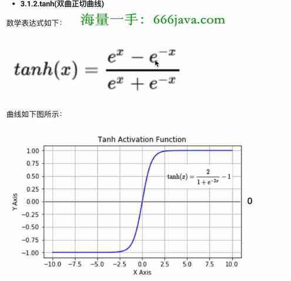
### 5.3 ReLU函数(最常用的激活函数)

#### relu的优势:  
>1. 节省计算量
>2. 避免梯度消失
>3. 由于部分输出为0，减少参数的相互依存性，缓解过拟合 
### 5.4 Leaky ReLU函数（是relu函数的变种，在relu函数的左侧添加一个斜率，即leak）

### 5.5 softmax函数（用于多分类问题,是二分类函数sigmoid函数的推广）
### 5.6 identity函数（用于回归问题）

## 6. 参数初始化
### 6.1 Xavier初始化
#### 6.1.1 正态化Xavier初始化(激活值和方差保持一致)
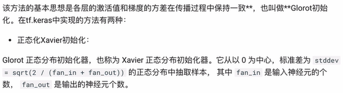    

**`tf.keras.initializers.glorot_normal()`**
#### 6.1.2 均匀化Xavier初始化

**`tf.keras.initializers.glorot_uniform()`**

### 6.2 He初始化
#### 6.2.1 正态化He初始化
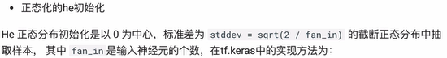

**`tf.keras.initializers.he_normal()`**
#### 6.2.2 均匀化He初始化
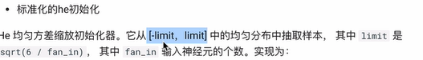

**`tf.keras.initializers.he_uniform()`**

## 7. 损失函数
### 7.1 分类任务
#### 7.1.1 多分类任务
在`tf.keras`中使用`CategoricalCrossentropy()`实现

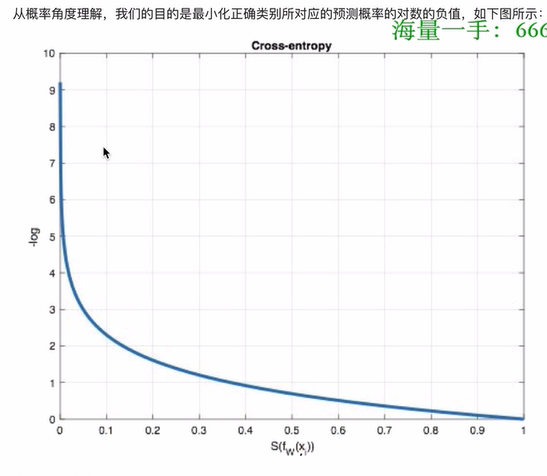
#### 7.1.2 二分类任务
在`tf.keras`中使用`BinaryCrossentropy()`实现

### 7.2 回归任务
#### 7.2.1 MAE损失（L1损失）
在`tf.keras`中使用`MeanAbsoluteError()`实现

#### 7.2.2 MSE损失（L2损失）
**注意： L2loss也常常作为正则项。当预测值与目标值相差很大时，梯度容易爆炸。**    

在`tf.keras`中使用`MeanSquaredError()`实现

#### 7.2.3 smooth L1损失
在`tf.keras`中使用`Huber()`实现

## 8. 优化算法
1. Epoch 迭代次数（全部数据集）
2. Batch 批次大小
3. iteration 迭代次数（一个Batch）
### 8.1 梯度下降算法(使损失函数最小化)

在`tf.keras`中使用`optimizers.SGD()`实现：   
1. learning_rate：学习率
2. momentum：动量
3. nesterov：是否使用Nesterov动量
4. name：优化器的名称
   
### 8.2 AdaGrad算法
在`tf.keras`中使用`optimizers.Adagrad()`实现：   
1. learning_rate：学习率
2. initial_accumulator_value：初始化累加器的值
3. name：优化器的名称
4. epsilon：一个小的数，防止除零错误（1e-07）
   
### 8.3 RMSProp算法（对学习率进行自适应调整）
在`tf.keras`中使用`optimizers.RMSprop()`实现：
1. learning_rate：学习率
2. rho：超参数(加权平均数)
3. momentum：动量
4. epsilon：一个小的数，防止除零错误（1e-07）
5. centered：是否使用中心化 RMSProp
   
### 8.4 Adam算法
在`tf.keras`中使用`optimizers.Adam()`实现：
1. learning_rate：学习率
2. beta_1：超参数(动量 0.9)
3. beta_2：超参数(超参数 0.999)
4. epsilon：一个小的数，防止除零错误（1e-8）
5. amsgrad：是否使用 AMSGrad
6. decay：学习率衰减
   
## 9. 学习率退火
### 9.1 分段常数衰减
在`tf.keras`中使用`optimizers.schedules.PiecewiseConstantDecay()`实现：
1. boundaries：一个包含学习率调整的边界的列表(范围)
2. values：一个包含学习率调整的列表（步长）

### 9.2 指数衰减

在`tf.keras`中使用`optimizers.schedules.ExponentialDecay()`实现：
1. initial_learning_rate：初始学习率
2. decay_steps：学习率衰减的步数（k值）
3. decay_rate：学习率衰减的速率（指数的底）
   
### 9.3 1/t衰减

在`tf.keras`中使用`optimizers.schedules.InverseTimeDecay()`实现：
1. initial_learning_rate：初始学习率
2. decay_steps：学习率衰减的步数（k值）

## 10. 正则化
### 10.1 L1 正则
在`tf.keras`中使用`tf.keras.regularizers.L1(l1 = 0.01)`实现

### 10.2 L2 正则
在`tf.keras`中使用`tf.keras.regularizers.L2(l2 = 0.01)`实现

### 10.3 L1L2 正则
在`tf.keras`中使用`tf.keras.regularizers.L1L2(l1 = 0.01, l2 = 0.01)`实现

### 10.4 Dropout正则化（随机失活）
在`tf.keras`中使用`tf.keras.layers.Dropout(rate = 0.5)`实现

### 10.5 提前停止
在`tf.keras`中使用`tf.keras.callbacks.EarlyStopping(monitor = 'val_loss', patience = 5)`实现：**在patience个epoch内没有提升，则停止训练**

## 11. BN层
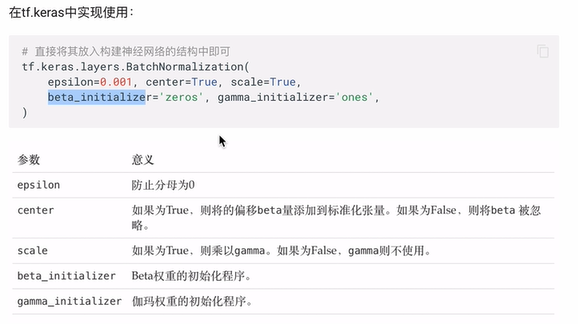

## 12 卷积神经网络
### 12.1 卷积层（核心模块，提取特征图的特征）
1. padding：使输出图像与原始图像相同
2. stride：步长
3. 多通道卷积：卷积核的通道数等于**输入**的通道数
4. 多卷积核卷积：卷积核的个数等于**输出**的通道数（每个卷积核学习到不同的特征）
5. 特征图大小： 
   - 输入体积大小：H1 W1 D1
   - 四个超参数：
     - Filter数量K
     - Filter大小F
     - 步长S
     - 零填充大小P
   - 输出体积大小：H2 W2 D2
   - H2 = (H1 + 2P - F) / S + 1
   - W2 = (W1 + 2P - F) / S + 1
   - D2 = K   

卷积核的使用`tf.keras.layers.Conv2D()`
1. filters：卷积核的个数
2. kernel_size：卷积核的大小
3. strides：卷积核的步长
4. padding：卷积核的填充方式
   - valid：不填充
   - same：填充
5. activation：激活函数

### 12.2 池化层
#### 12.2.1 最大池化层(取窗口内的最大值为输出)

在`tf.keras`中使用`tf.keras.layers.MaxPooling2D()`
1. pool_size：池化核的大小
2. strides：池化核的步长
3. padding：池化核的填充方式
#### 12.2.2 平均池化层(取窗口内平均值为输出)

在`tf.keras`中使用`tf.keras.layers.AveragePooling2D()`
1. pool_size：池化核的大小
2. strides：池化核的步长
3. padding：池化核的填充方式
   
### 12.3 全连接层

在`tf.keras`中使用`tf.keras.layers.Dense()`

# 图像分类
## 1.AlexNet
### 1.1 网络架构
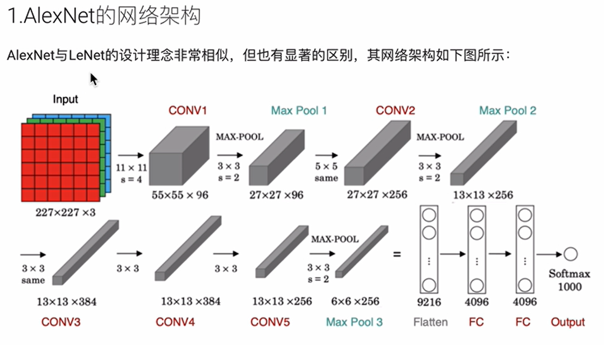
### 1.2 特点
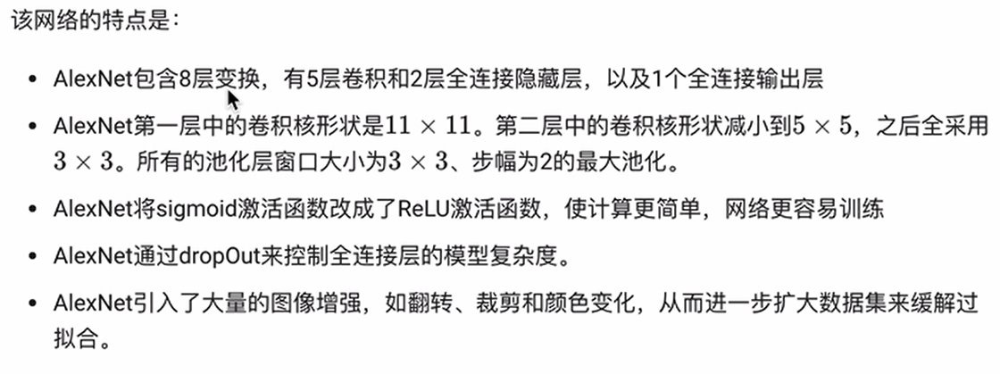

## 2.VGG
### 2.1 网络架构
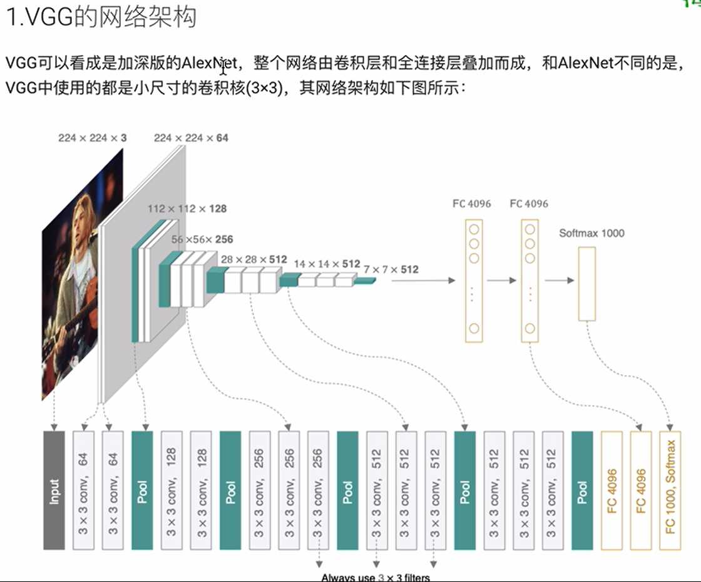
### 2.2 特点
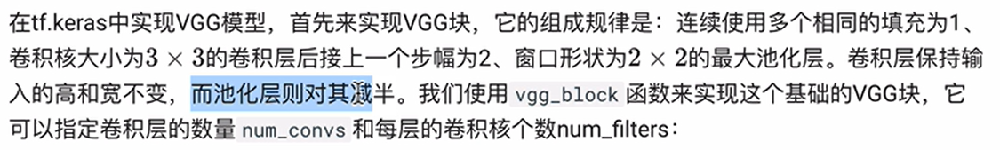

## 3. GoogleNet
### 3.1 网络架构

### 3.1.1 Inception模块
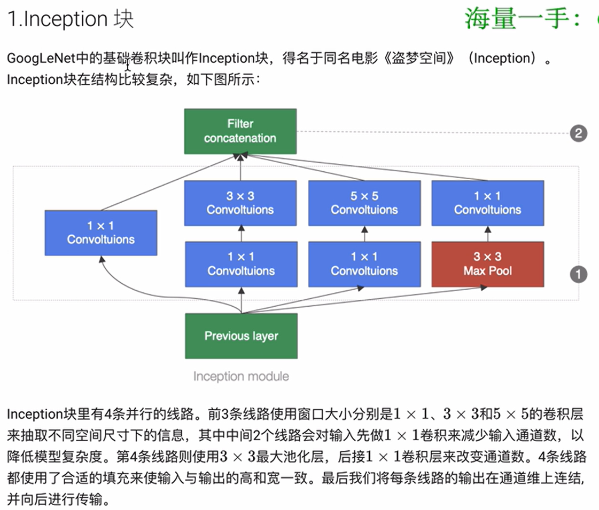
- B1模块
- B2模块
- B3模块
- B4模块
- B5模块
- 辅助分类器

## 4. ResNet
### 4.1 网络架构

#### 4.1.1 残差块
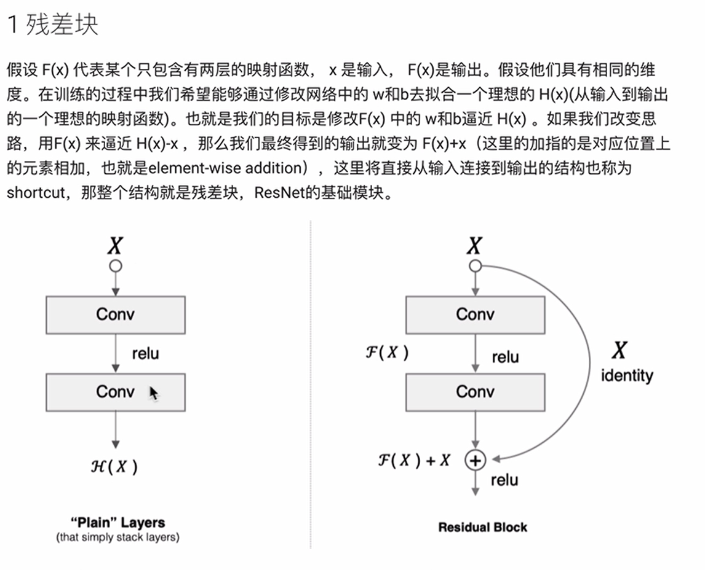
### 4.2 特点
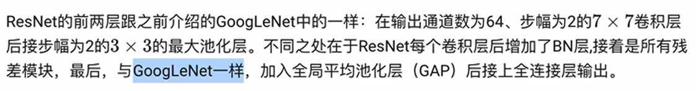

## 5. 图像增强方法
### 5.1 几何变换类
- 翻转    
  
   左右：`tf.image.flip_left_right()`  
  上下：`tf.image.flip_up_down()`
- 旋转
- 缩放
- 裁剪  
  
  随机裁剪`tf.image.random_crop(image, size)`
- 变形
  
### 5.2 颜色变换类
- 模糊
- 颜色变化   
  
  亮度:`tf,image.random_brightness(image, max_delta)`
- 擦除
- 填充
  
### 5.3 图像增强
在`tf.keras`中使用`tf.keras.preprocessing.image.ImageDataGenerator()`实现：
1. rescale：尺寸调整
2. rotation_range：旋转角度（整形）
3. width_shift_range：宽度平移（浮点数）
4. height_shift_range：高度平移（浮点数）
5. brightness_range：亮度范围
6. shear_range：剪切角度（浮点数）
7. zoom_range：缩放范围（浮点数）
8. horizontal_flip：水平翻转
9. vertical_flip：垂直翻转
   
### 5.4 读取图像文件
在前一步要进行归一化处理,将像素值归一化到0-1之间。

`image_generator = tf.keras.preprocessing.image.ImageDataGenerator(rescale=1./255)`    

`图像类.flow_from_directory(directory, target_size, batch_size, class_mode)`
1. directory：数据集目录
2. target_size：图片尺寸
3. batch_size：批量大小
4. class_mode：分类模式
5. shuffle：是否打乱数据

    
## 6.模型微调
- 在源数据上预训练一个神经网络模型
- 创建一个新的神经网络模型，复制源模型上除了输出层外所有模型设计及参数
- 添加一个输出大小为目标数据集类别个数输出层，并随机初始化该层模型参数
- 训练该模型
**当目标数据集远小于源数据集时，有助于提升模型的泛化能力**

# 目标检测
## 1.评价指标
-  IOU（交并比）
-  mAP（平均精度）
-  NMS（非极大值抑制）
## 2. 目标检测方法分类
- two-stage
- one-stage
  
# R-CNN网络架构
- 1. 候选区生成（选择性搜索）
- 2. CNN网络提取特征（选取预训练卷积神经网络）
- 3. 目标分类（训练支持向量机）
- 4. 目标定位（训练回归模型，生成更准确的边界框）
# Faster-RCNN网络架构
- 1. 候选区生成（选择性搜索）
- 2. CNN网络提取特征
- 3. ROIPooling(送入全连接层)   
  **使用ROIpooling层替换预训练模型中最后的池化层，并将超参数H,W设置为和网络第一个全连接层兼容的值**
- 4. 目标检测
  - 一个输出各类别加上一个背景类别的softmax概率估计
  - 一个确定位置

