# TensorFlow入门(7月18日)
## 1.初识TensorFlow
>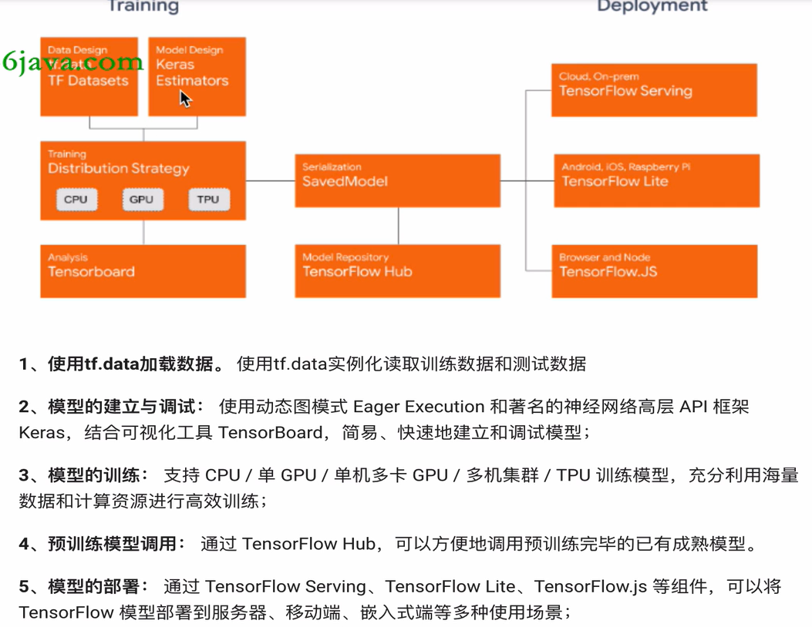
## 2.张量（Tensor）
张量是一个多维数组
>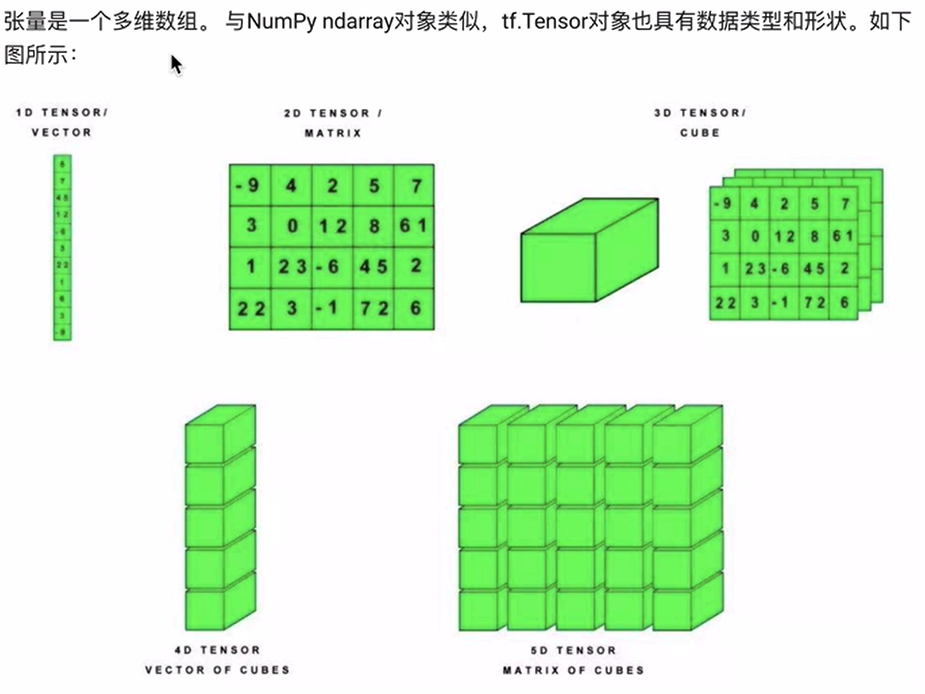
### 2.1 TensorFlow库的导入
>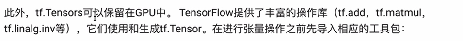
`import tensorflow as tf`  
### 2.2 张量的创建
代码：
>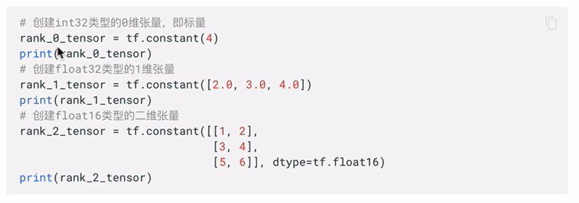   

结果：
>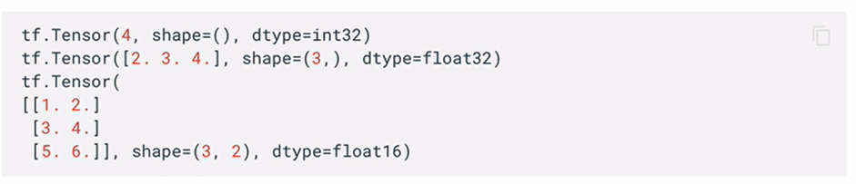
>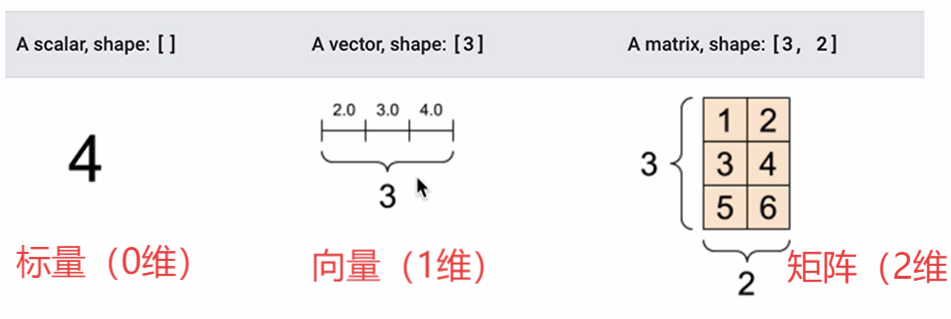

**语法：`变量名 = tf.constant(值,dtype=数据类型,shape=(维度))`**  

**【通常只用在函数内写出对应维度的值即可】**

#### 创建更高维的张量：
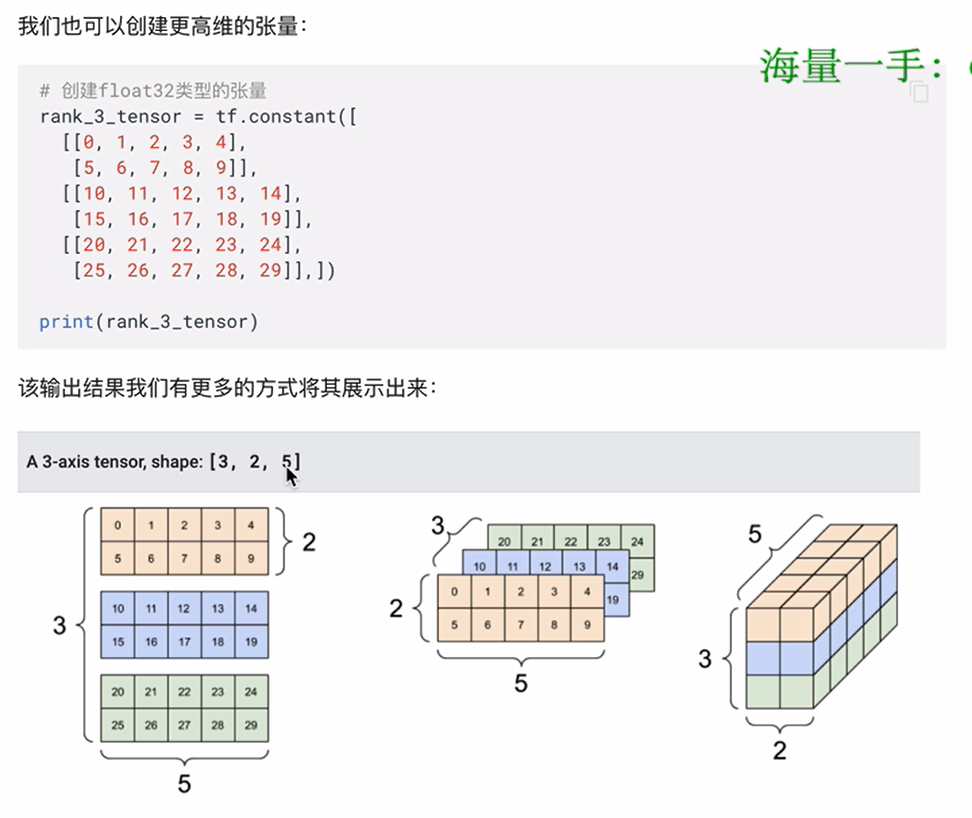
### 2.3 张量转换为numpy
通常由两张方式转换：
- 利用numpy：`np.array(张量)`
- 利用TensorFlow：`张量.numpy()`
### 2.4 张量的运算
#### 2.4.1 简单运算：
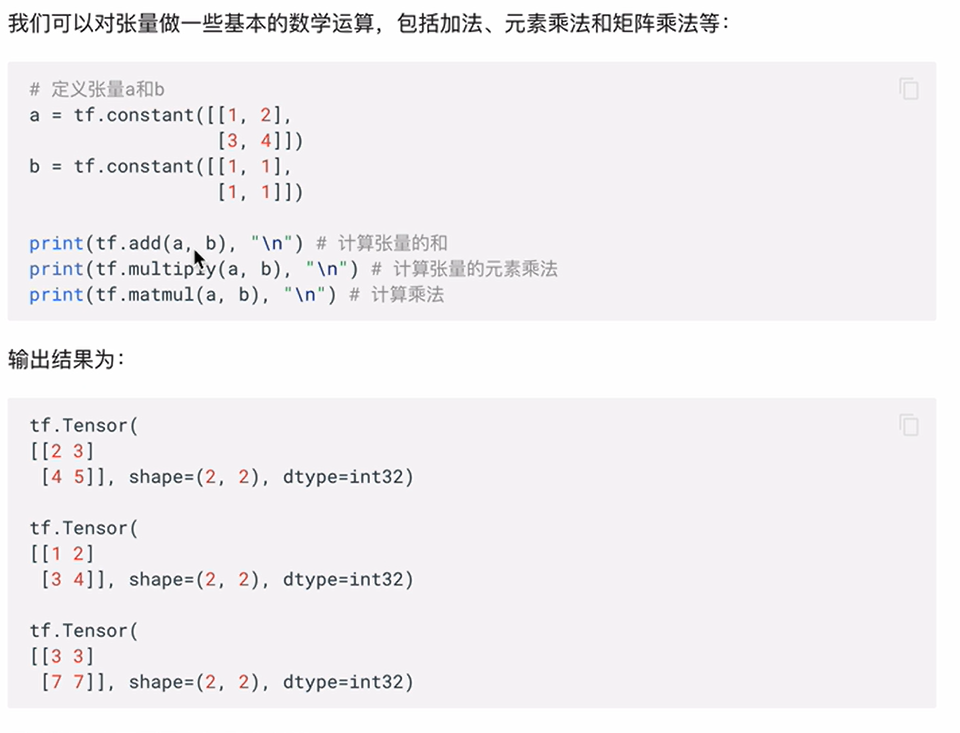
#### 2.4.2 聚合运算
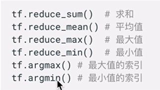
### 2.5 变量
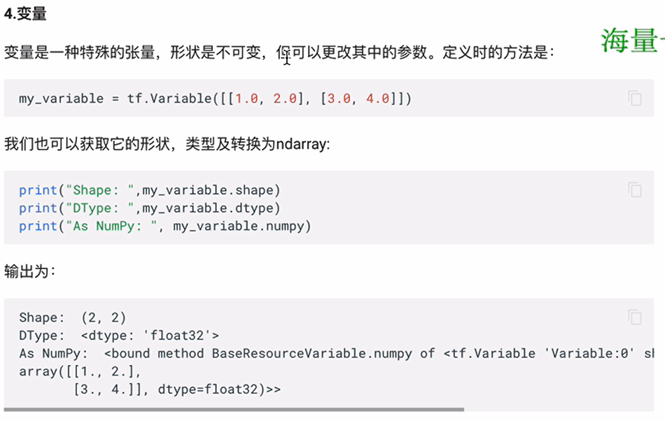
**变量是一种特殊的张量，形状是不可变的，但可以更改其中的参数**  
语法： **`变量名 = tf.Variable(初始值,dtype=数据类型)`**  
更改语法： **`变量名.assign(新的值)`**
## 3.kears介绍
>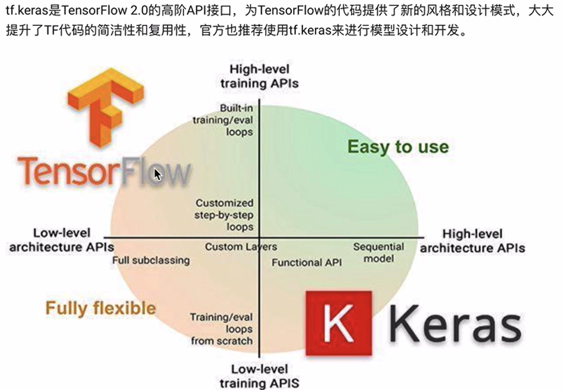
### 3.1 常用模块
>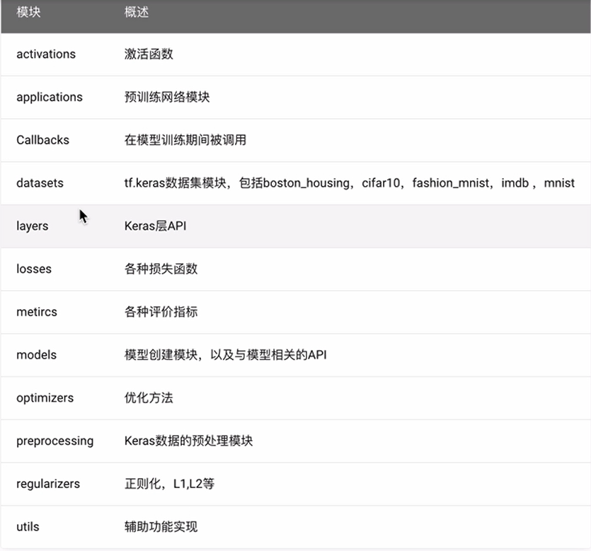
### 3.2 常用方法
#### 3.2.1 深度学习实现的主要流程
1. 获取数据
2. 数据基本处理
3. 模型创建与训练
4. 模型测试与评估
5. 模型预测
>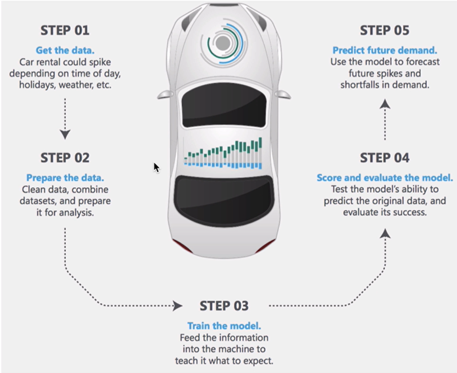
##### 3.2.1.1 模型测试与评估
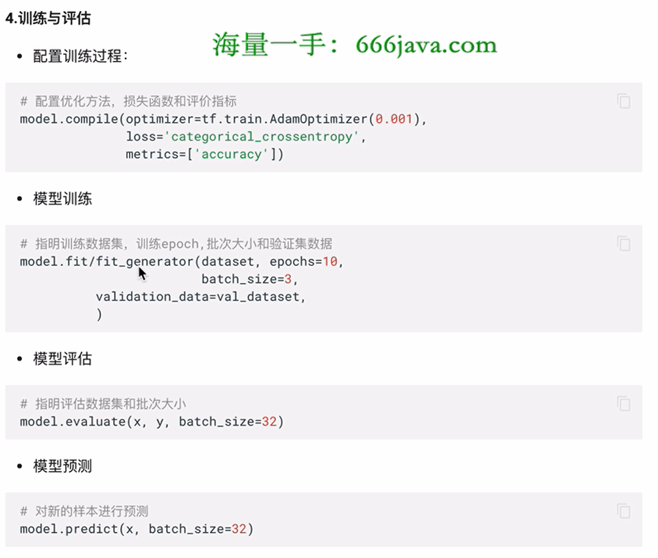
##### 3.2.1.2 回调函数
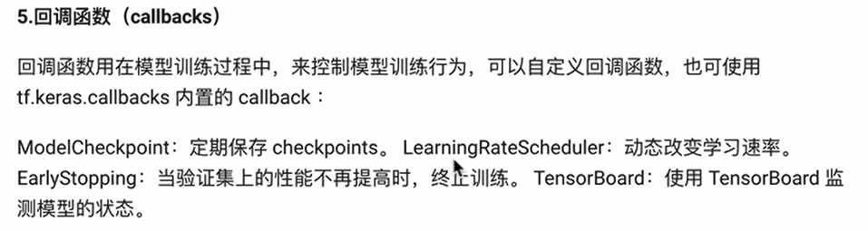
##### 3.2.1.3 模型保存与加载（参数与模型结构）
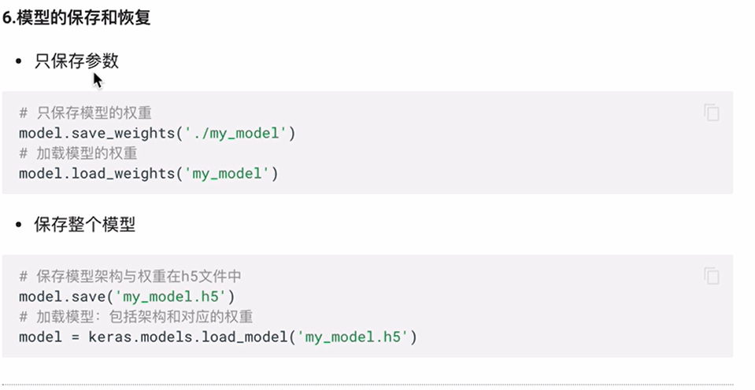