# 模型微调
## 1. 微调
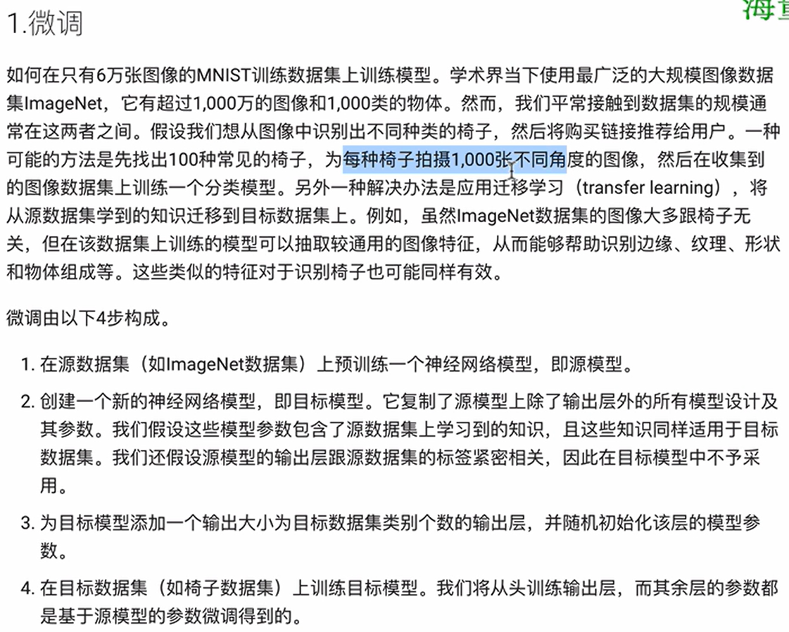
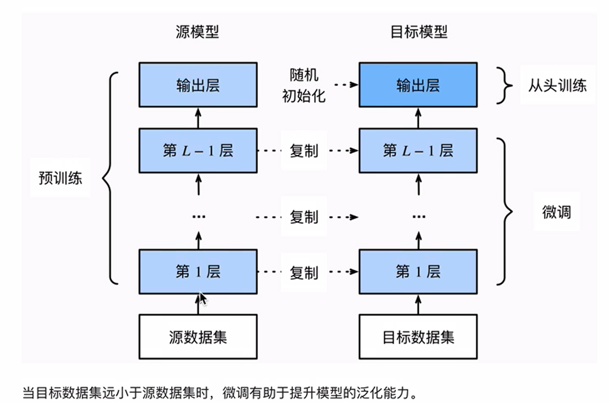
## 2. 热狗识别
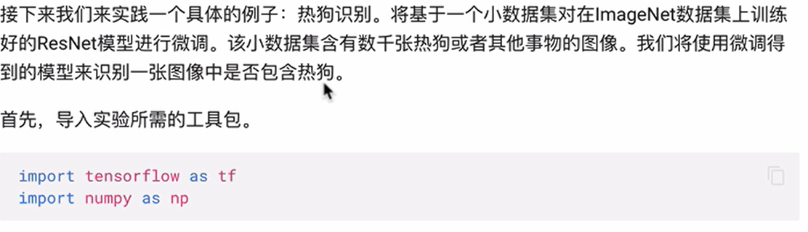
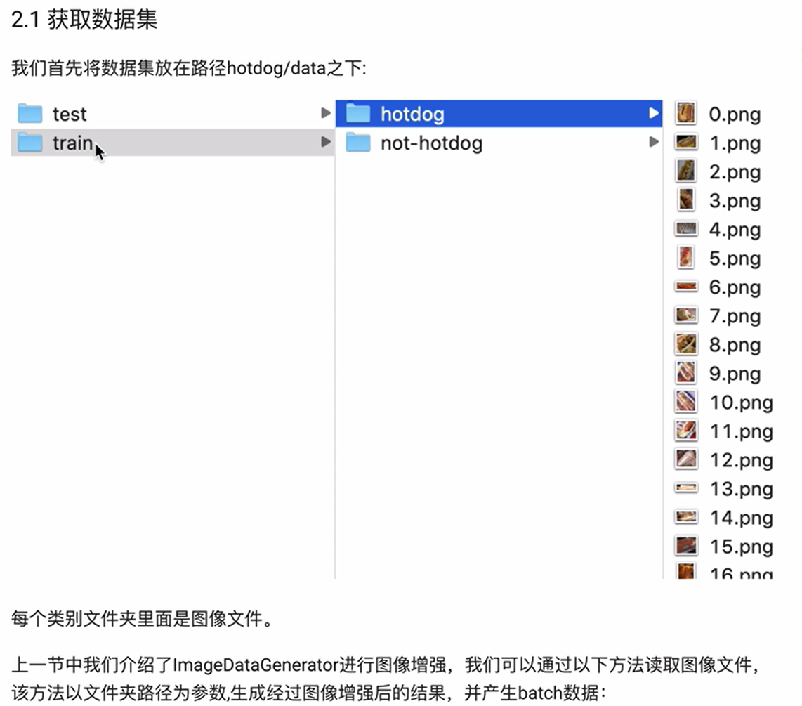
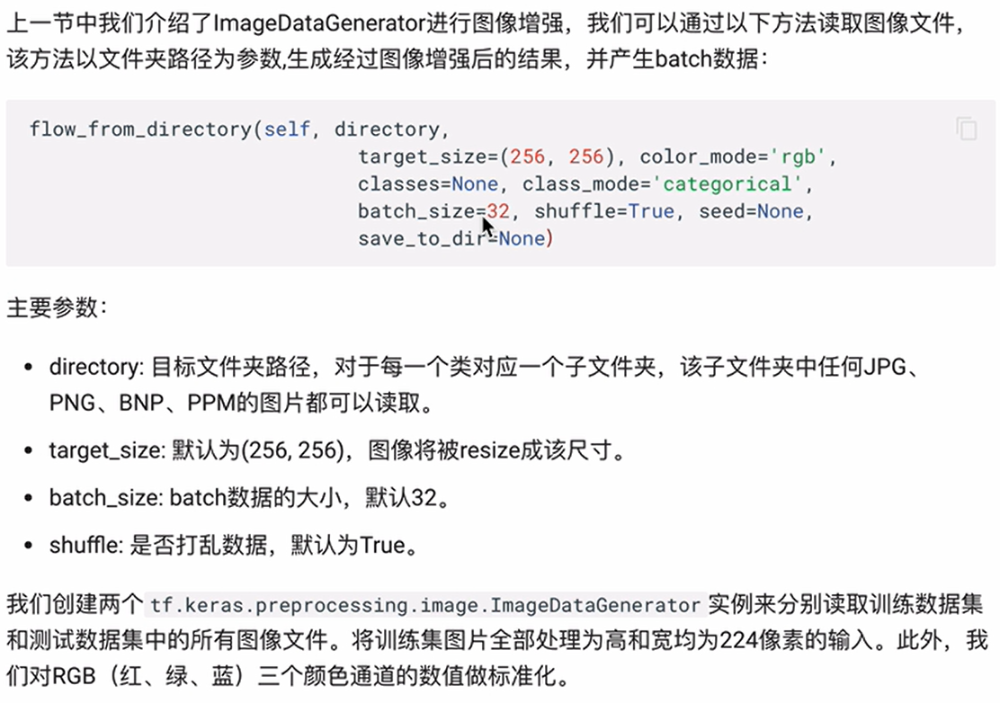
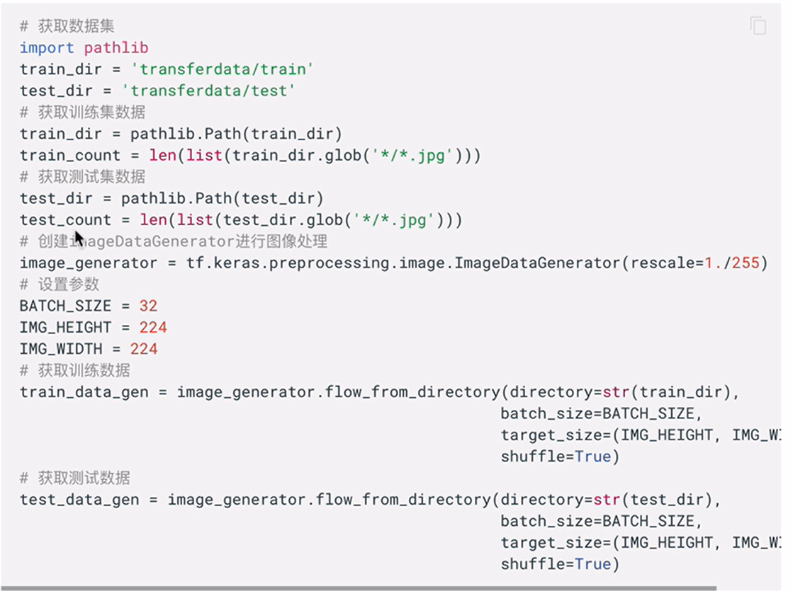
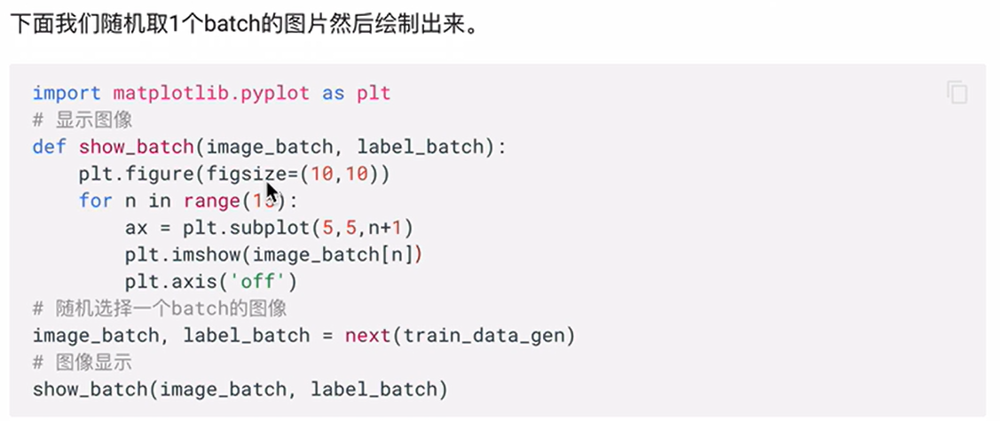

**注意：**
> 1. image_generator = tf.keras.preprocessing.image.ImageDataGenerator(rescale=1./255)    
其目的是进行归一化操作，将像素值归一化到0-1之间。

## 3. 模型构建与训练
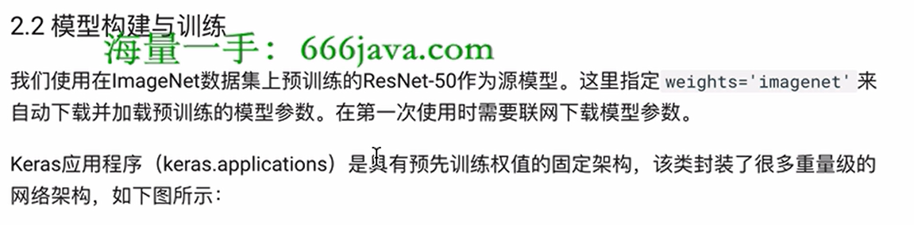
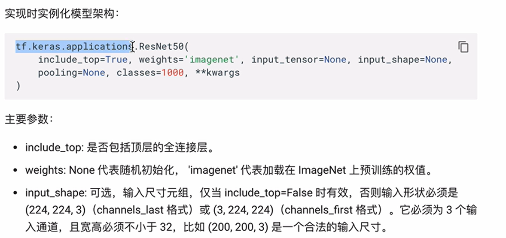
### 3.1 模型构建
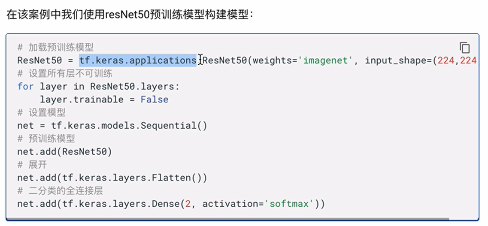
### 3.2 模型训练
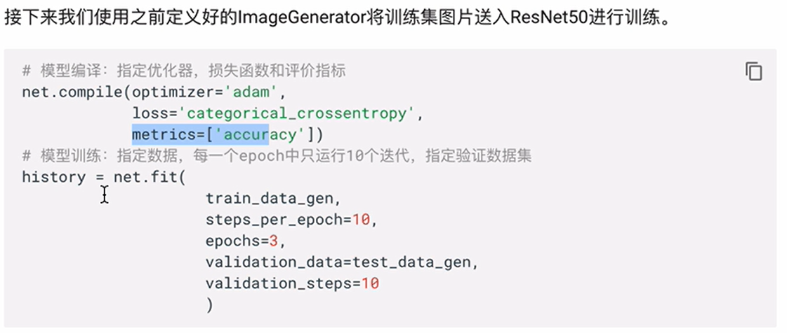

