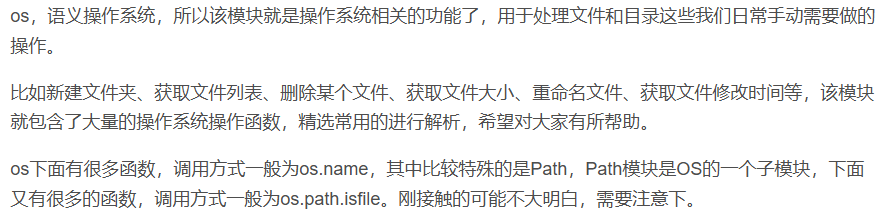
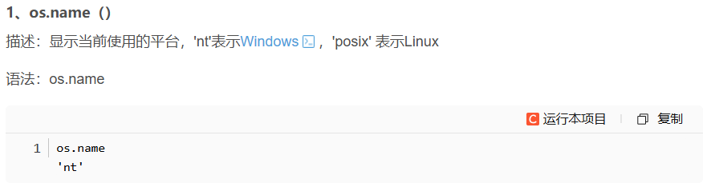
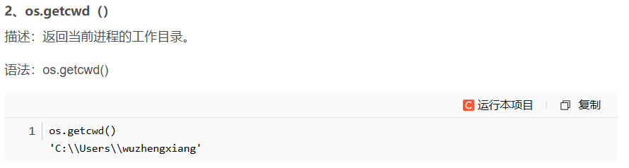
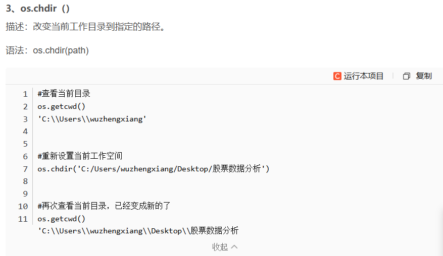
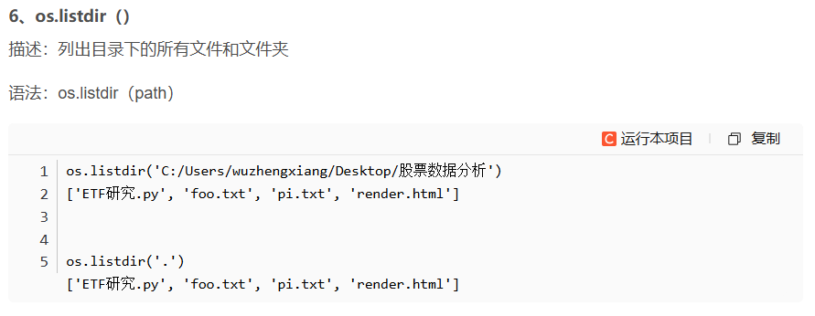
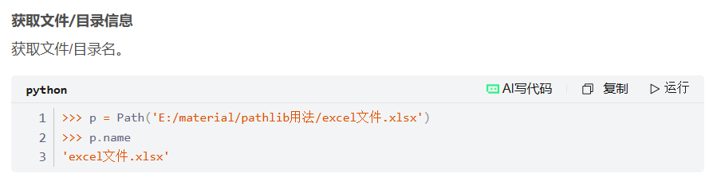
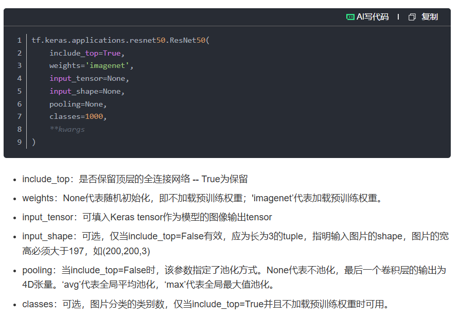

# 补充知识
## 1. os 模块

可参考：https://blog.csdn.net/wulishinian/article/details/106420532
### 1.1 os.name

### 1.2 os.getcwd()

### 1.3 os.chdir()

### 1.4 os.listdir()

## 2. pathlib 模块
可参考：https://blog.csdn.net/qq_43965708/article/details/122537713
### 2.1 pathlib.Path()

## 3.ResNet api

