# TensorFlow入门(7月19日)
## 1. 快速入门模型（鸢尾花模型）
### 1.1 导入头文件
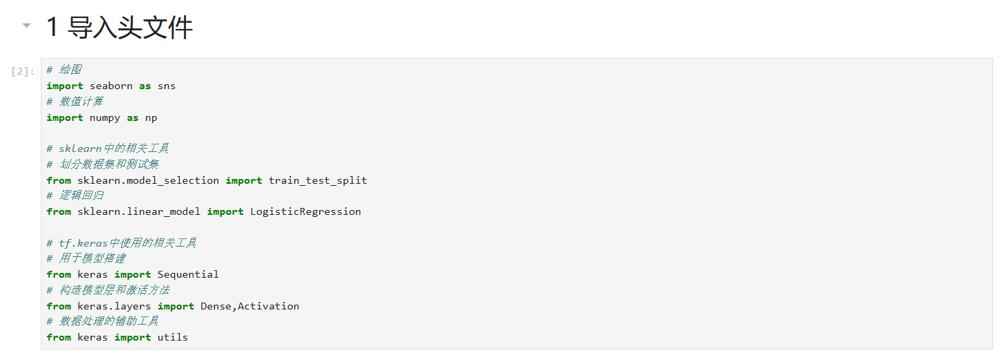
**注意：自2024年之后 keras可直接使用，无需在用tensorflow.keras调用**
### 1.2 获取数据+数据处理
#### 1.2.1 获取数据
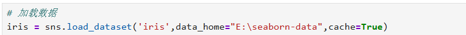
**注意： 由于seaborn是国外库，在使用load_dataset()时，会报出各种代理错误，此时需要更改参数**
>data_home&nbsp;&nbsp;&nbsp;&nbsp;&nbsp;&nbsp;&nbsp;&nbsp;&nbsp;&nbsp;&nbsp;&nbsp;&nbsp;&nbsp;&nbsp;seaborn数据文件地址     
>cache&nbsp;&nbsp;&nbsp;&nbsp;&nbsp;&nbsp;&nbsp;&nbsp;&nbsp;&nbsp;&nbsp;&nbsp;&nbsp;&nbsp;&nbsp;&nbsp;&nbsp;&nbsp;&nbsp;&nbsp;&nbsp;&nbsp;&nbsp;是否为本地加载数据
#### 1.2.2 数据分析
  
利用sns.pairplot()绘制出数据关系，以便划分数据集 
>**绘制数据关系:**     
>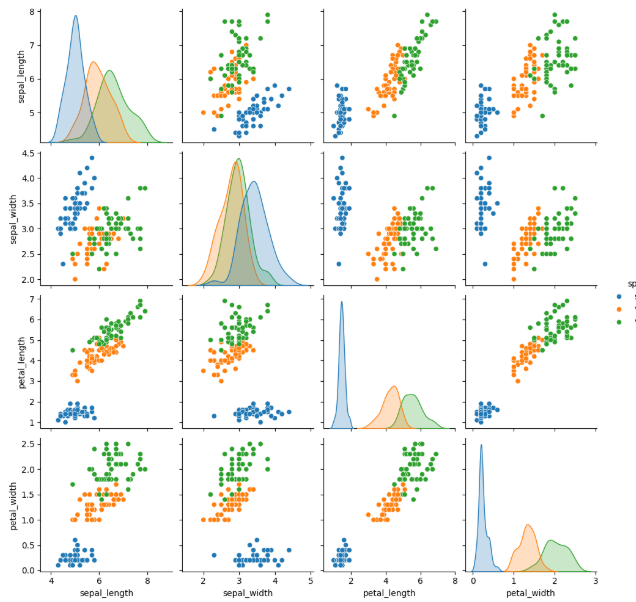
#### 1.2.3 数据预处理
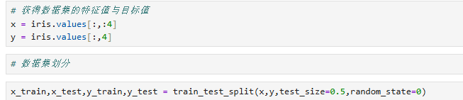
### 1.3 模型创建与训练（机械学习）
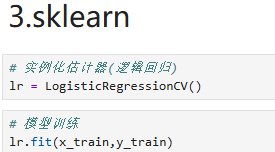
1. 实例化估计器  
2. 模型训练
### 1.4 模型测试与评估
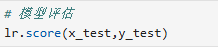
### 1. 5 tf.keras实现
#### 1.5.1tf.keras与sklearn的比较
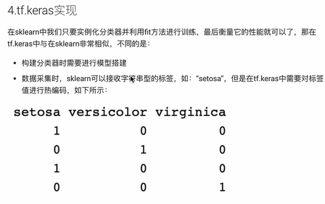
> **对于深度学习：**
> 1. 构建分类器时需要进行模型搭建
> 2. 数据采集时需要对标签值进行热编码
> 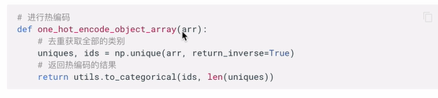    
 
复习：np.unique

1. 介绍
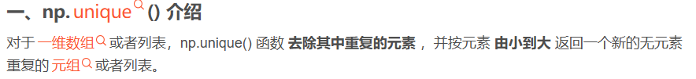
2. 使用
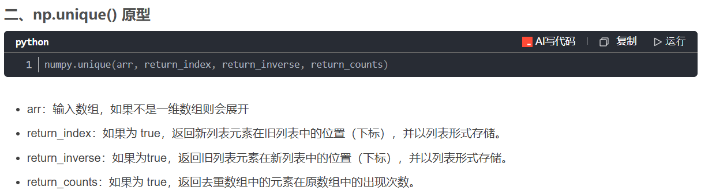
3. 实例
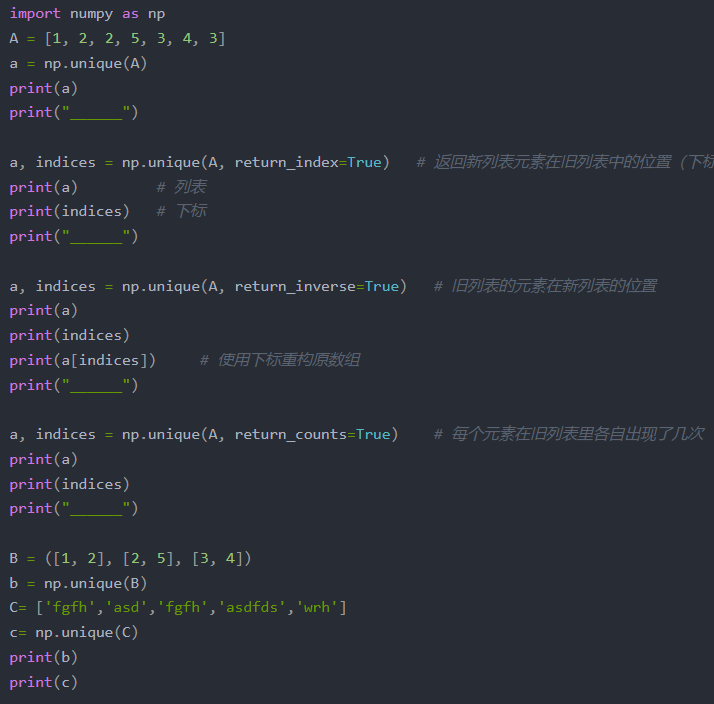
4. 实例结果   
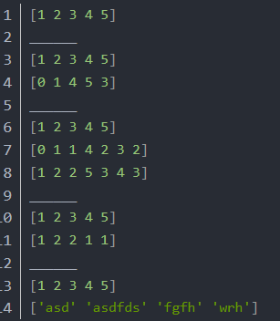

#### 1.5.2 tf.keras 模型搭建
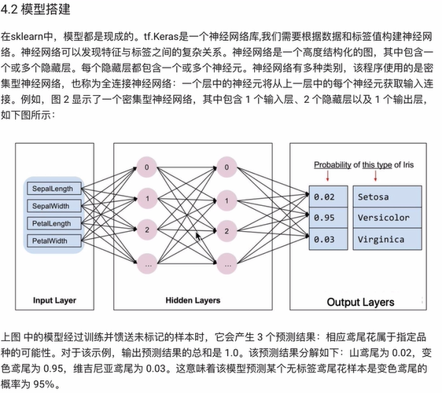
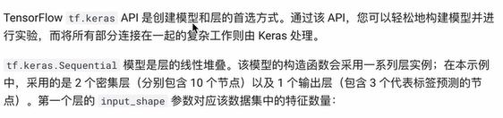
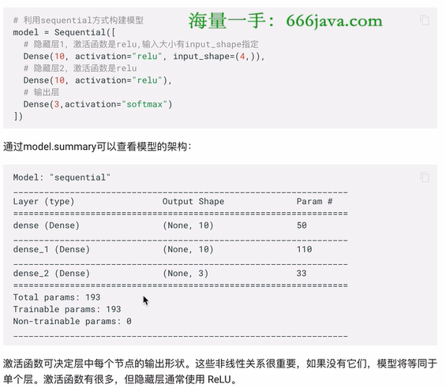
> 实例：
> 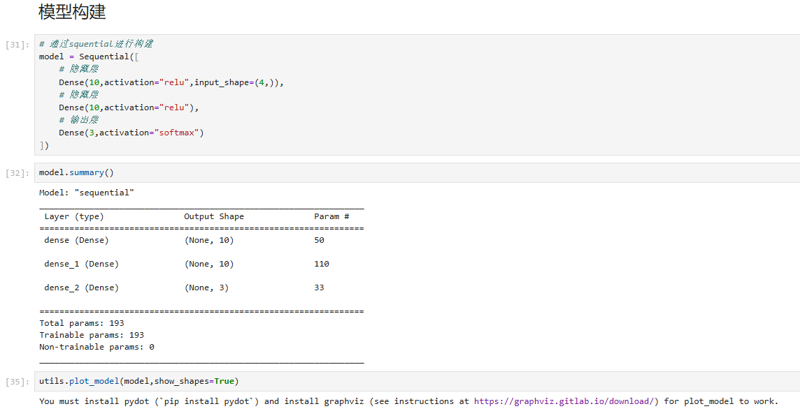

#### 1.5.3 模型训练与预测
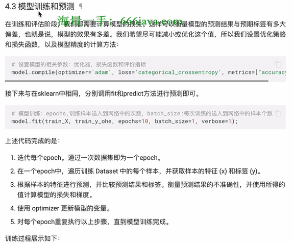
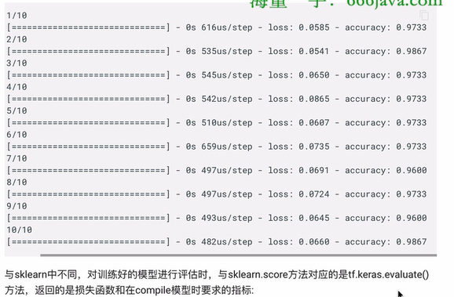
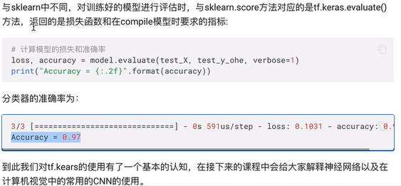
> 实例：
> 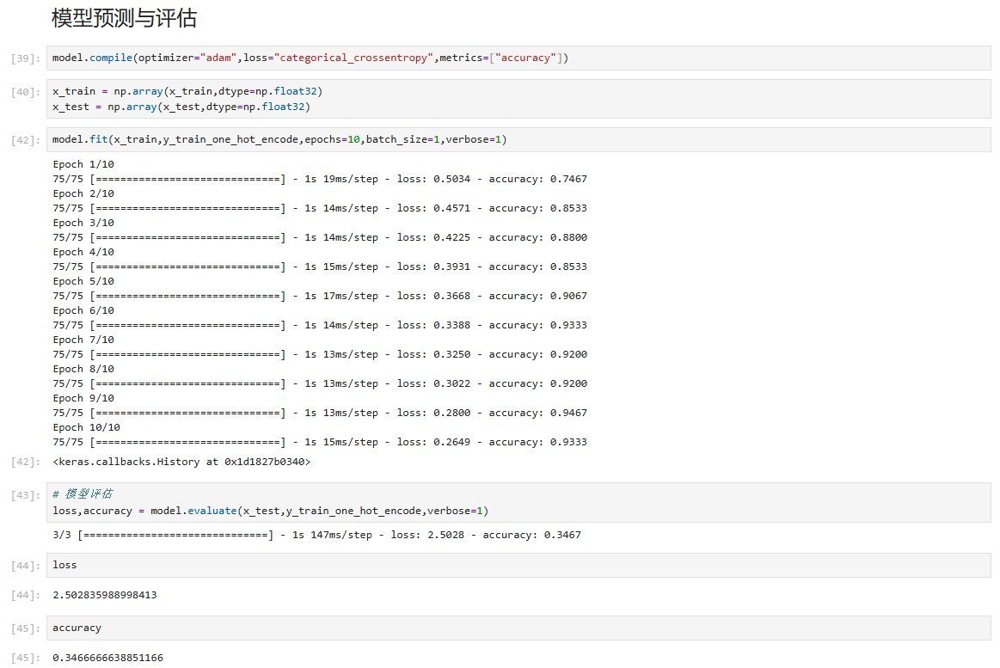