# TensorFlow入门(7月20日)
# 1.深度神经网络
## 1.1 什么是神经网络
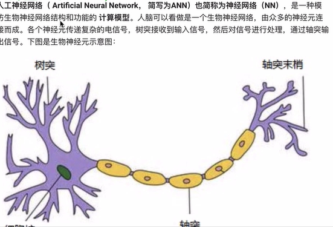
树突接收信号->通过神经元处理->轴突输出结果
### 1.1.1 怎么构建人工神经网络中的神经元
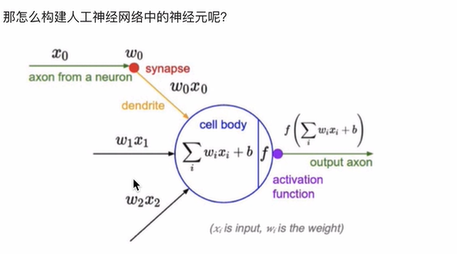
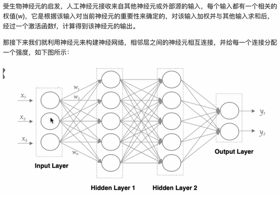
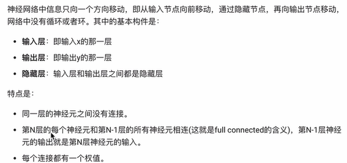
### 1.1.2 神经元是如何工作的？
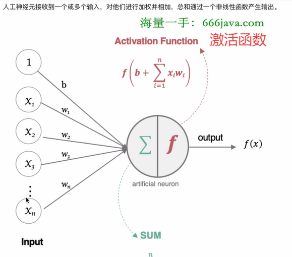

## 1.2激活函数
**激活函数：引入非线性因素**
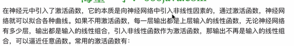
### 1.2.1 Sigmoid函数
1. #### Sigmoid函数一般用于二分类的输出层
>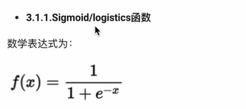
>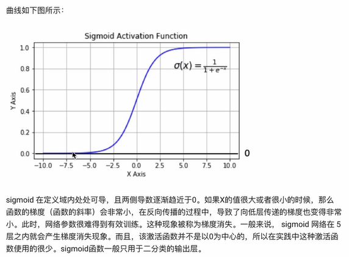
**实现方法：**  
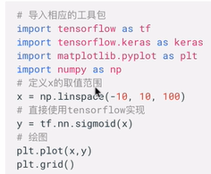    
**输出结果：**
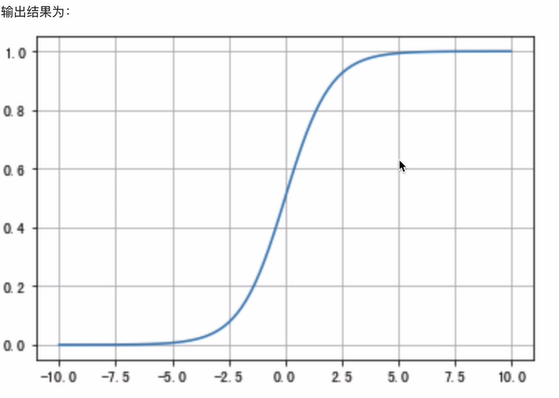
### 1.2.2 tanh函数

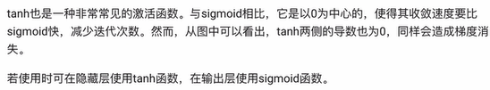
> 1. 收敛速度快，迭代次数少
> 2. 隐藏层使用tanh函数,输出层使用sigmoid函数    
> 
**实现方法：**    
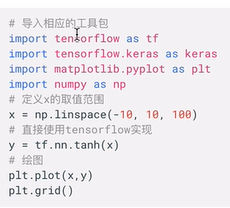   
**输出结果：**    
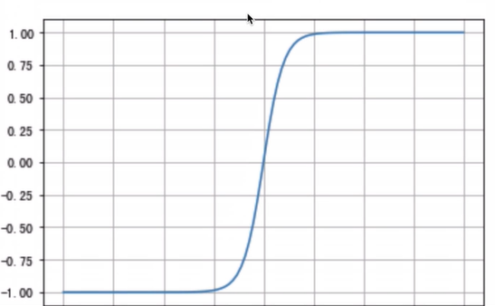
### 1.2.3 relu函数
1. relu函数是最常用的激活函数            
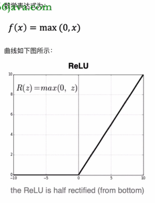
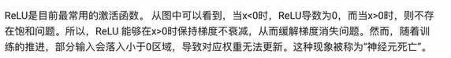
2. relu的优势:    
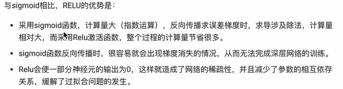    
>1. 节省计算量
>2. 避免梯度消失
>3. 由于部分输出为0，减少参数的相互依存性，缓解过拟合    

**实现方法：**    
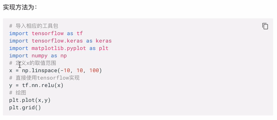    
**输出结果：**    
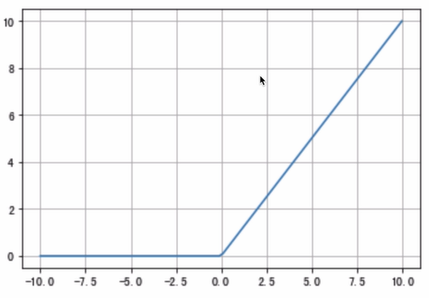    
### 1.2.4 leakrelu函数
1. leakrelu函数是relu函数的变种，在relu函数的左侧添加一个斜率，即leak    
>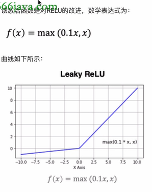    

**实现方法：**    
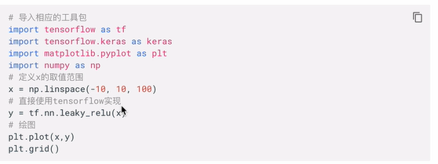    
### 1.2.5 softmax函数
1. softmax函数用于多分类问题,是二分类函数sigmoid函数的推广，目的是将多分类的结果以概率的形式展现出来。
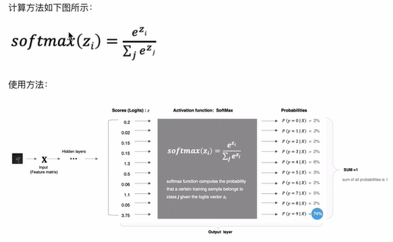
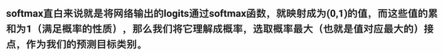

**实现方法：**    
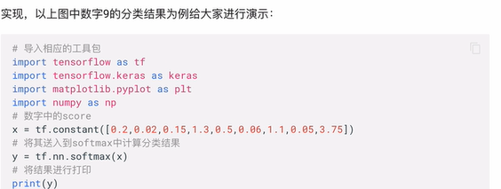
### 1.2.6 其他激活函数
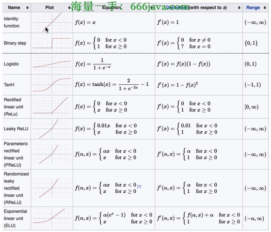
## 1.3 如何选择激活函数
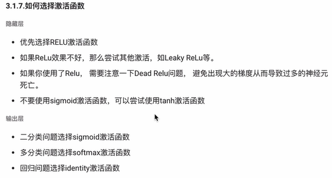