# TensorFlow入门(7月21日)
## 1.参数初始化
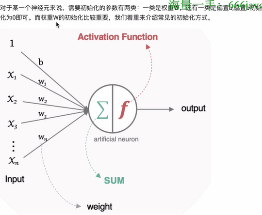
### 1.1 随机初始化(很少使用)
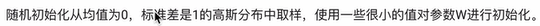
### 1.2 标准初始化（很少使用）
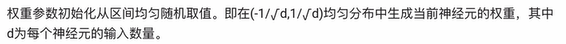
### 1.3 Xaiver初始化
#### 1.3.1 正态化Xavier初始化
    
**实现方法：**    
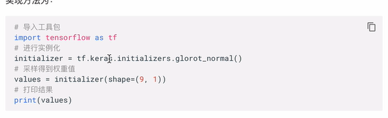    
**输出结果：**    
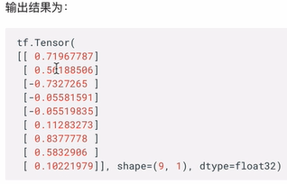
#### 1.3.2 标准化Xavier初始化
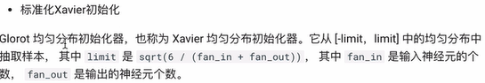    
**实现方法：**    
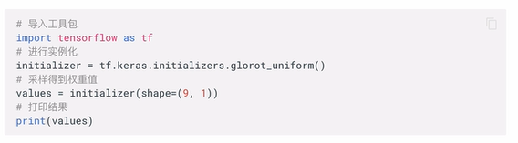    
**输出结果：**    
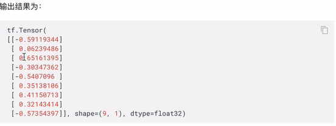
### 1.4 He初始化

#### 1.4.1 正态化He初始化
   
**实现方法：**    
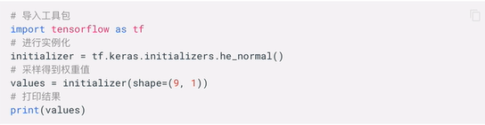    
**输出结果：**    
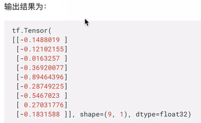
#### 1.4.2 标准化He初始化
  
**实现方法：**    
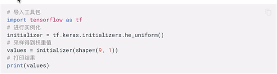
## 2.神经网络的搭建
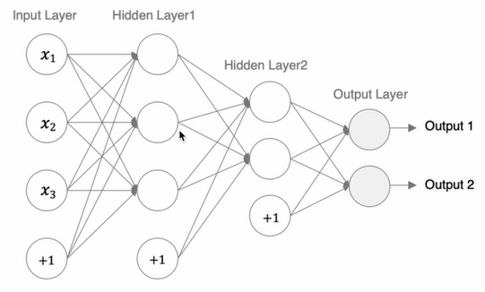
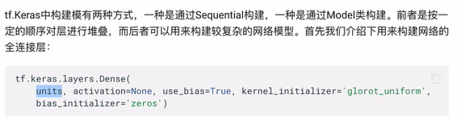
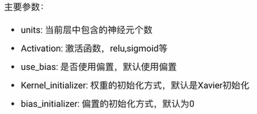
### 2.1 通过Sequential()搭建神经网络
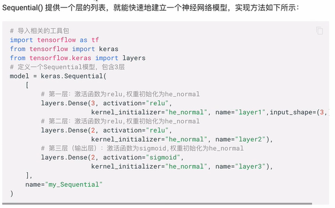
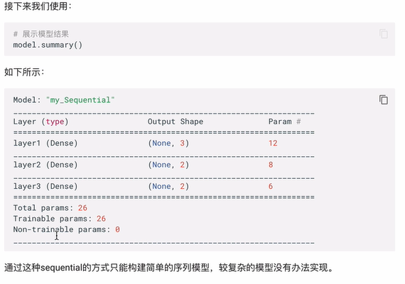
### 2.2 通过function API搭建神经网络    
**原理：将层作为可调用对象并返回张量,并将输入向量和输出向量提供给`tf.keras.Model`的`imputs`和`outputs`参数**     
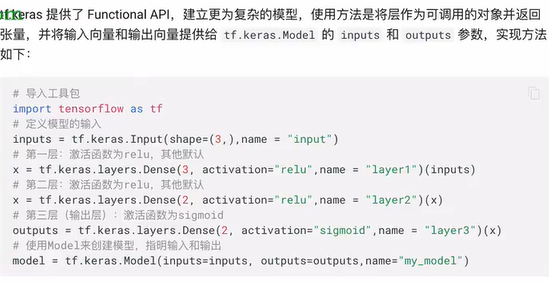
### 2.3 通过model的子类构建
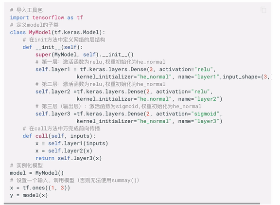     
**复习：call()方法**    
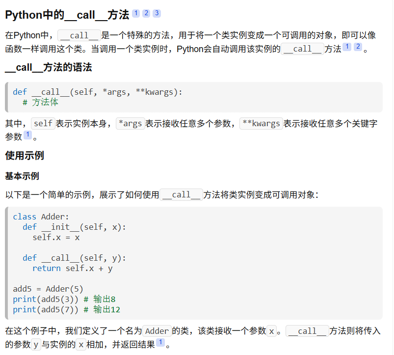    

#### 2.3.1 实现方法：
> 1. 定义一个model的子类，继承tf.keras.Model
> 2. 定义__init__()方法，初始化model的层结构
> 3. 定义call()方法，定义网络的前向传递

## 3. 神经网络的优缺点
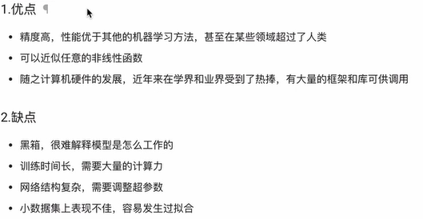