# TensorFlow入门(7月22日)
## 1.常见的损失函数
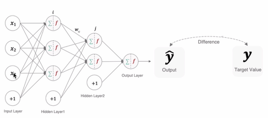
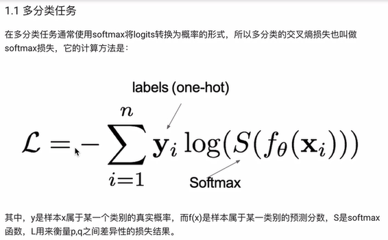
### 1.1 分类任务
在分类任务中，最多使用的是

交叉熵损失函数，下面介绍这种损失函数：
#### 1.1.1 多分类任务

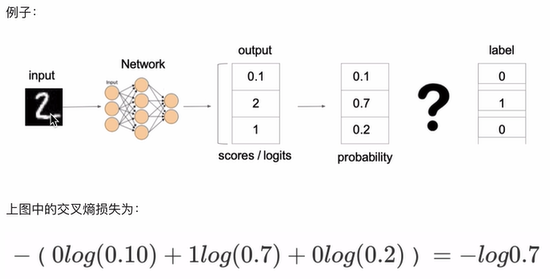
  

在`tf.keras`中使用`CategoricalCrossentropy()`实现，如下图所示：    
 
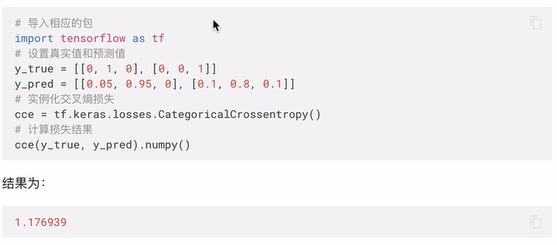

#### 1.1.2 二分类任务
在二分类任务中，使用`BinaryCrossentropy()`实现，如下图所示：
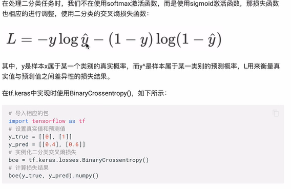

### 2.1 回归任务
#### 2.1.1 MAE损失（L1 loss）
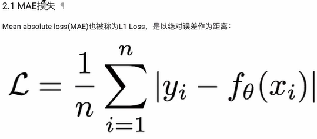
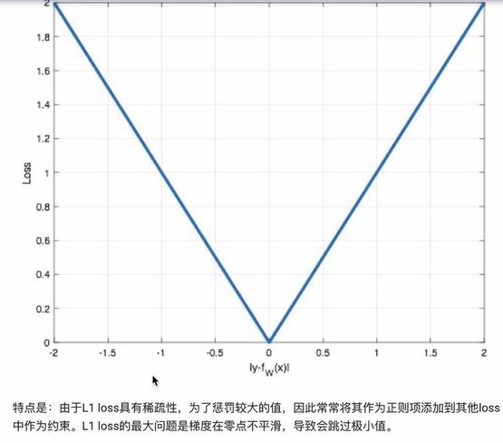    

在`tf.keras`中使用`MeanAbsoluteError()`实现，如下图所示：    
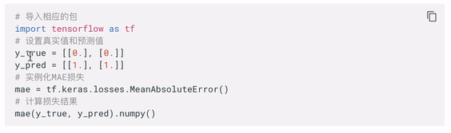

#### 2.1.2 MSE损失(L2 loss 欧氏距离)
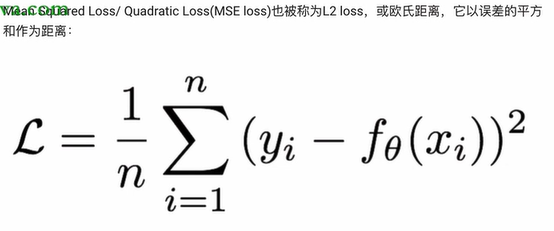
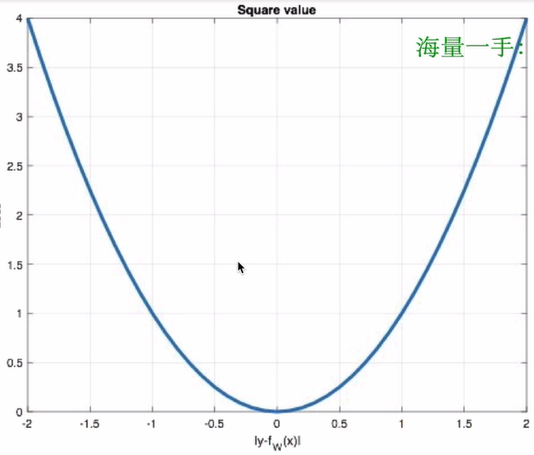
**注意： L2loss也常常作为正则项。当预测值与目标值相差很大时，梯度容易爆炸。**    

在`tf.keras`中使用`MeanSquaredError()`实现，如下图所示：
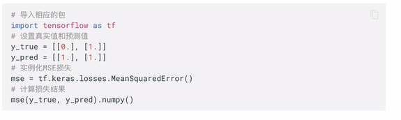

#### 2.1.3 smooth L1损失
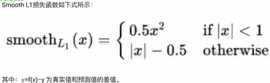
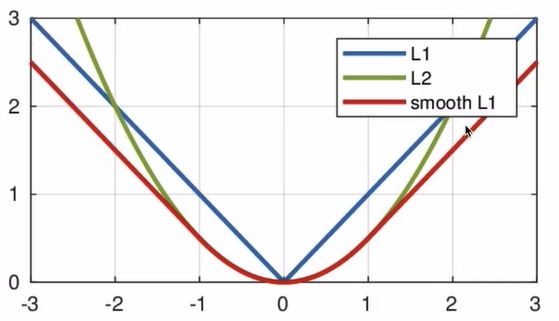
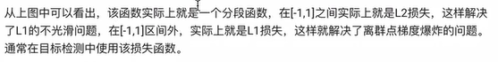    

在`tf.keras`中使用`Huber()`实现，如下图所示：    
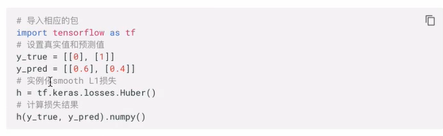