# TensorFlow入门(7月23日)
## 1.深度学习的优化方法
### 1.1 梯度下降算法（使损失函数最小化）
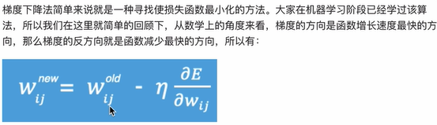
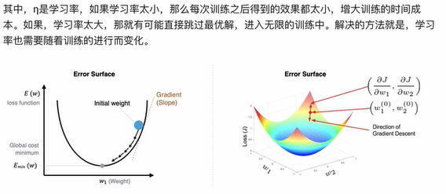
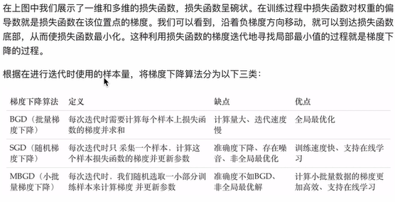
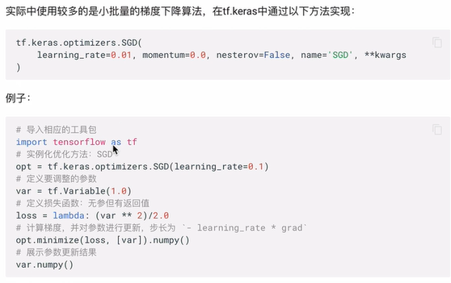
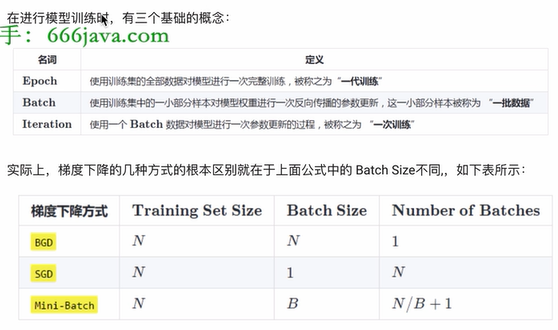
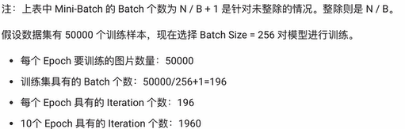
### 1.2 反向传播算法（BP算法）
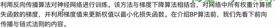
#### 1.2.1 前向传播与反向传播
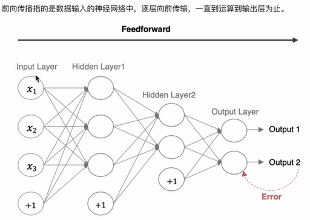
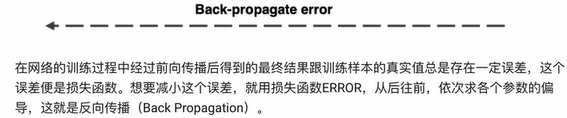
#### 1.2.2 链式法则
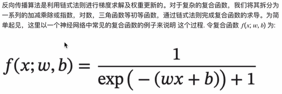
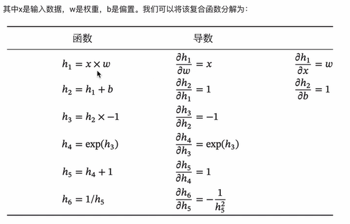
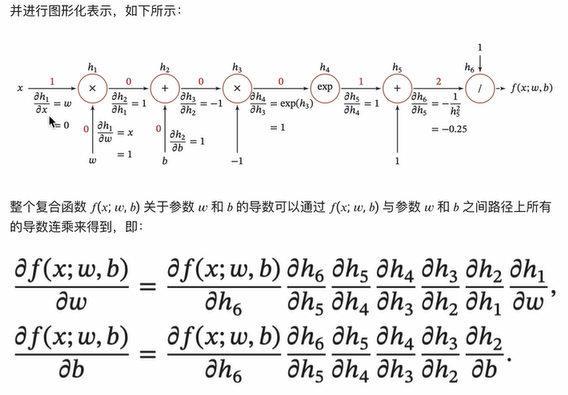
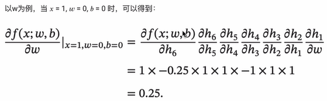
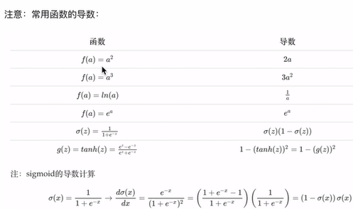
### 1.3 梯度下降优化算法
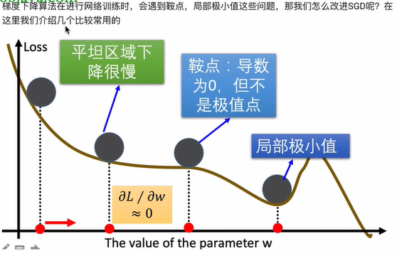
#### 1.3.1 动量算法
**动量算法主要解决鞍点问题**

##### 1. 指数加权平均
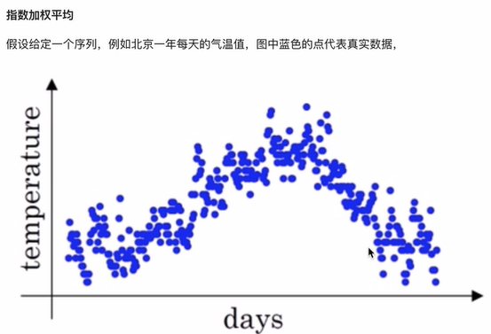
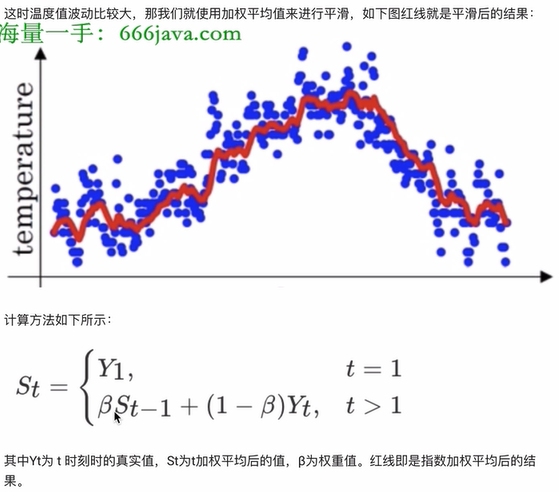
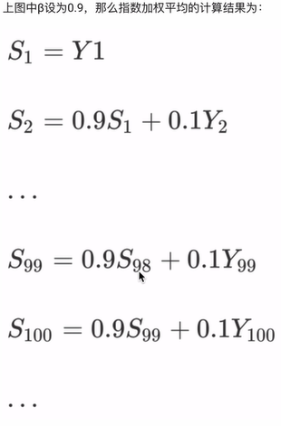
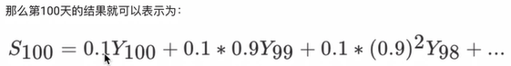
##### 2. 动量梯度下降算法（对梯度进行修正）
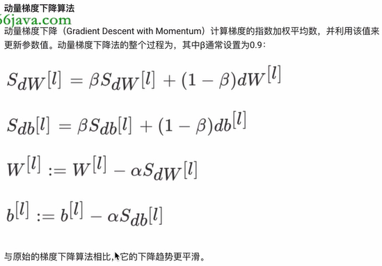
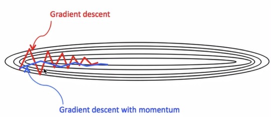
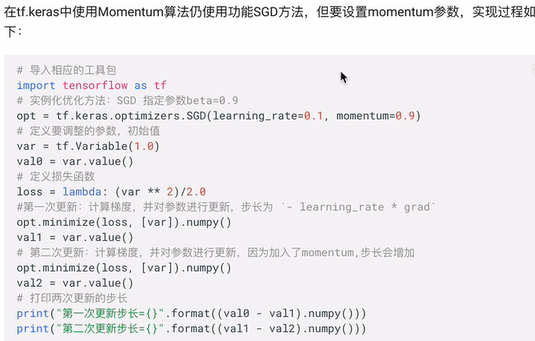
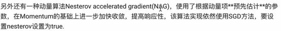
#### 1.3.2 AdaGrad算法
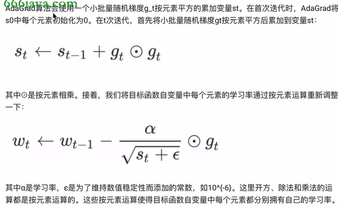
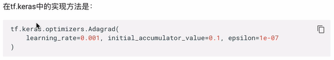
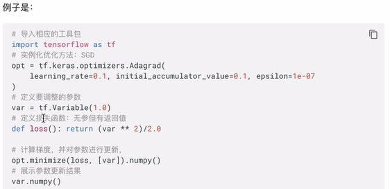
#### 1.3.3 RMSprop算法（对学习率进行修正）
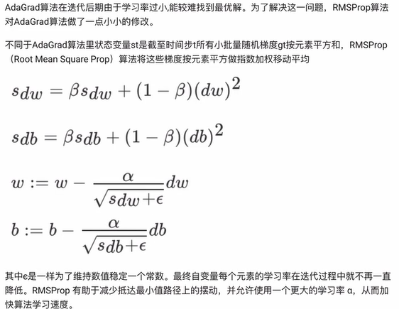
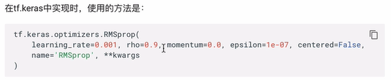
#### 1.3.4 Adam算法（对梯度和学习率进行修正）
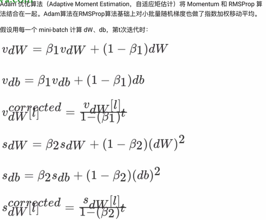
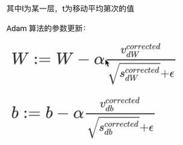
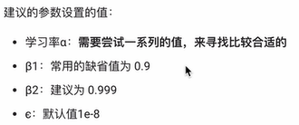
### 1.4 学习率退火
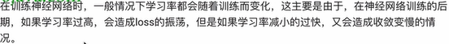
#### 1.4.1 分段常数衰减
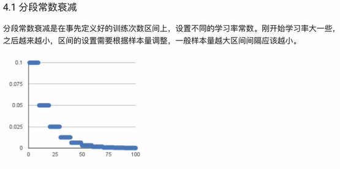
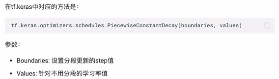
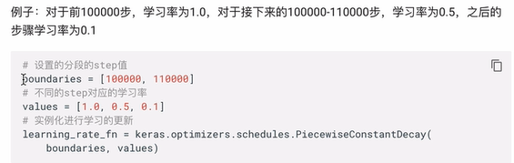
#### 1.4.2 指数衰减
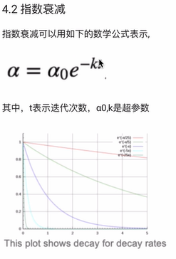
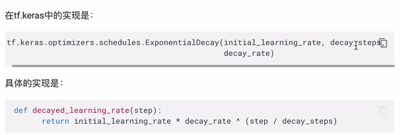
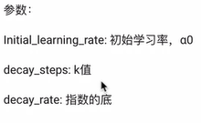
#### 1.4.3 1/t衰减
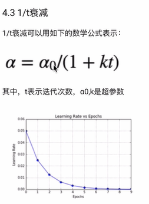
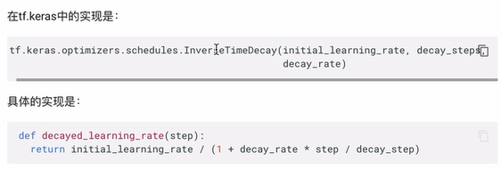
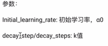
