# TensorFlow入门(7月24日)
## 1.深度学习的正则化
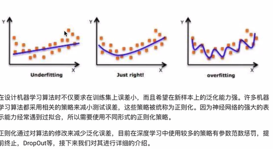
### 1.1 L1与L2正则化
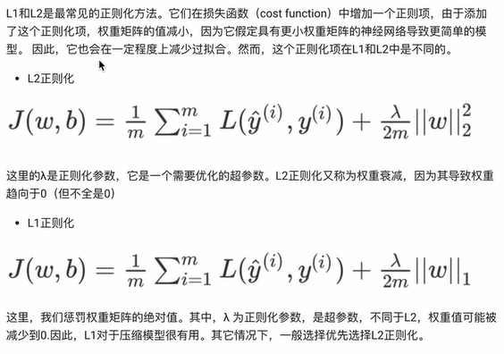
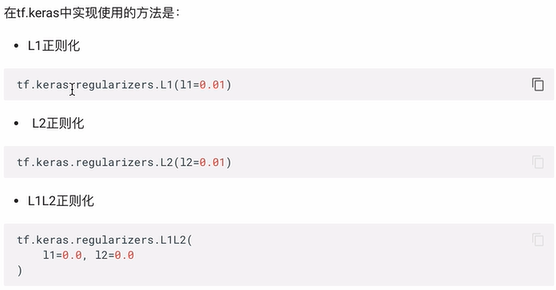
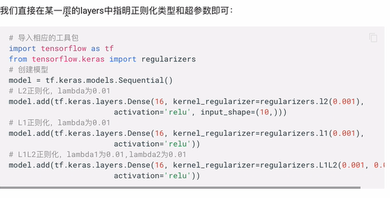
### 1.2 Dropout正则化
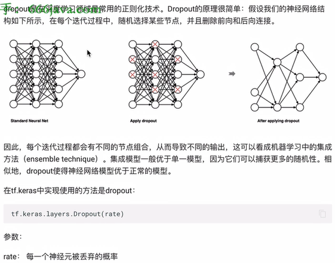
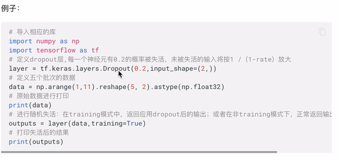
### 1.3 提前停止
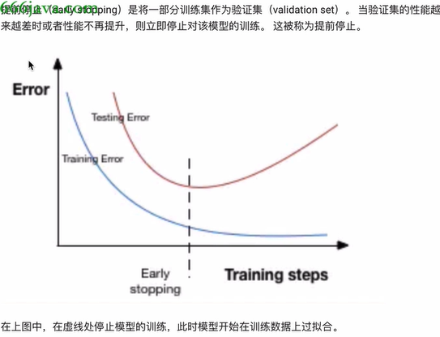
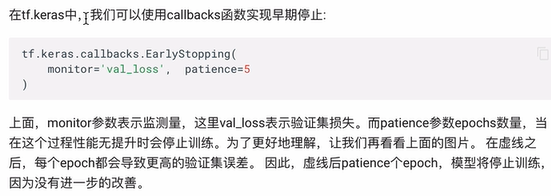
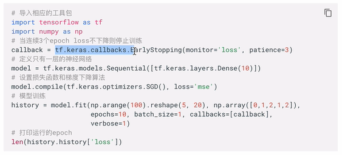
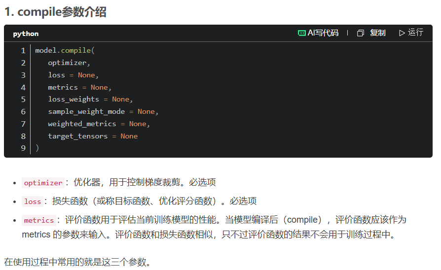
### 1.4 批标准化（BN层）
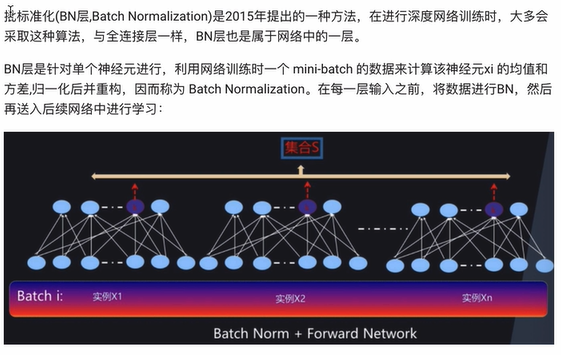
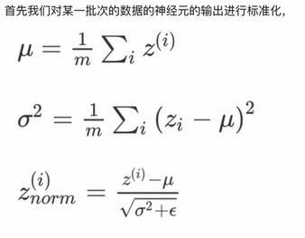
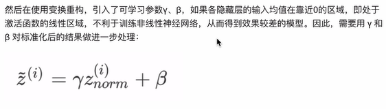
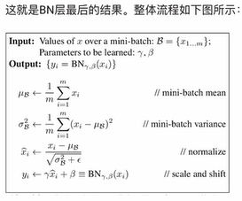

**https://blog.csdn.net/python_LC_nohtyp/article/details/104449363?ops_request_misc=%257B%2522request%255Fid%2522%253A%25224a072050cb46a1676a0bfa9520c8bdbc%2522%252C%2522scm%2522%253A%252220140713.130102334.pc%255Fall.%2522%257D&request_id=4a072050cb46a1676a0bfa9520c8bdbc&biz_id=0&utm_medium=distribute.pc_search_result.none-task-blog-2~all~first_rank_ecpm_v1~rank_v31_ecpm-1-104449363-null-null.142^v102^pc_search_result_base4&utm_term=%E6%89%B9%E6%A0%87%E5%87%86%E5%8C%96%E5%B1%82batchnorm%E4%BD%9C%E7%94%A8tensorflow&spm=1018.2226.3001.4187**

**BN层（很重要）：**
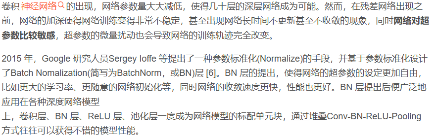
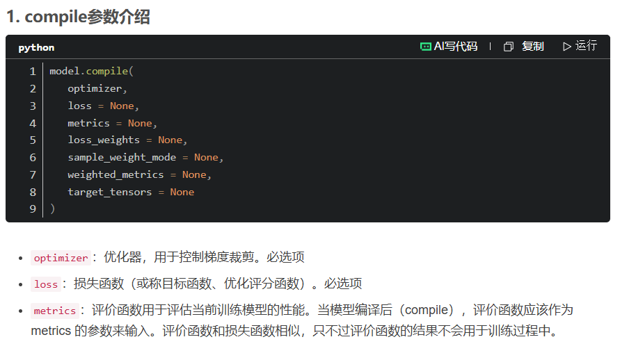