# TensorFlow入门(7月29日)
## 1. 卷积神经网络CNN
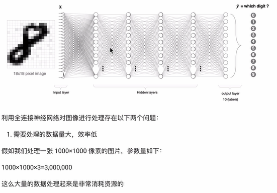
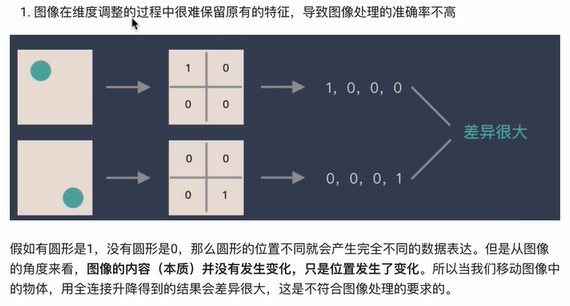
### 1.1 卷积层
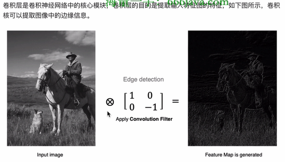
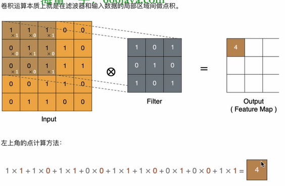
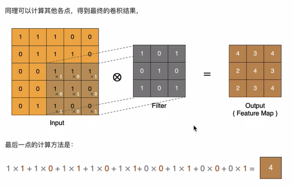
#### 1.1.1 padding（输出图像与原始图像相同）
**注意：** 在周围填充数据0
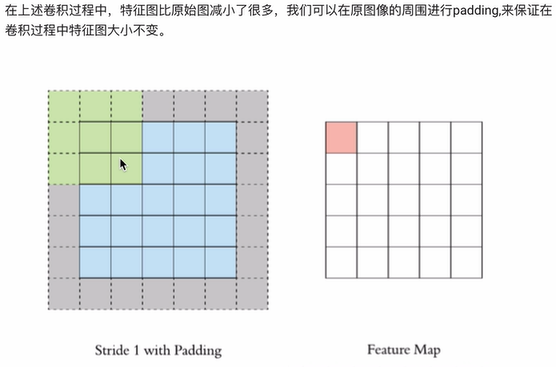
#### 1.1.2 步长stride
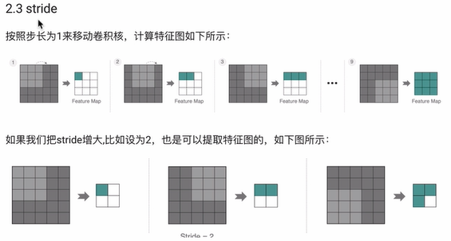
#### 1.1.3 多通道卷积
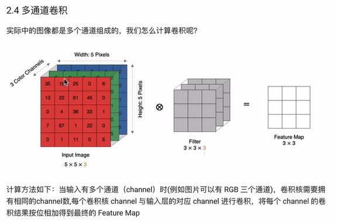
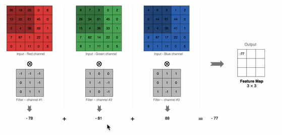
#### 1.1.4 多卷积核卷积
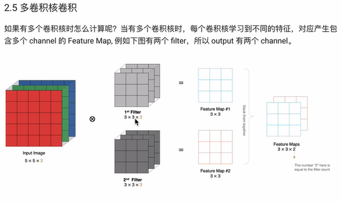
#### 1.1.5 特征图大小
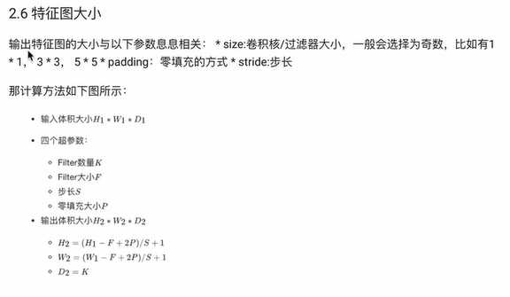
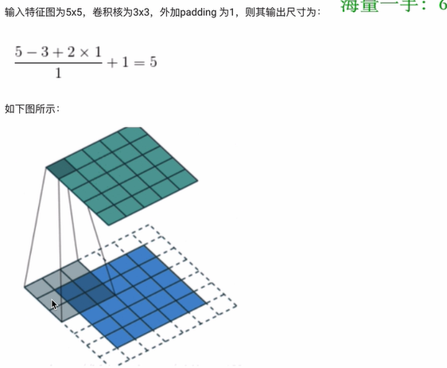
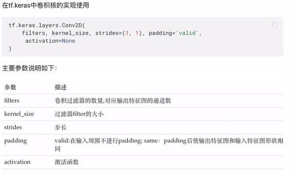
### 1.2 池化层
#### 1.2.1 最大池化层（广泛）
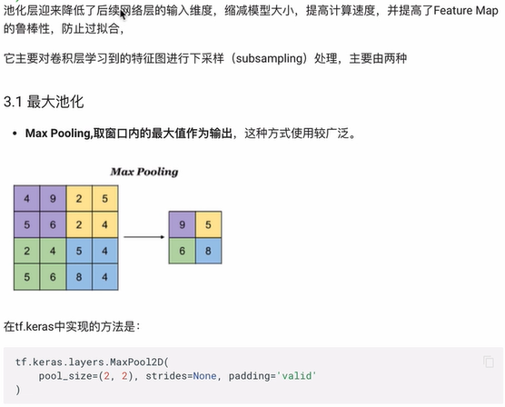
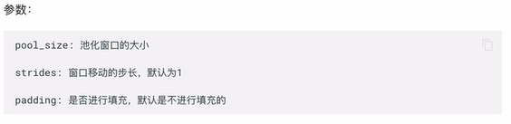
#### 1.2.2 平均池化层（）
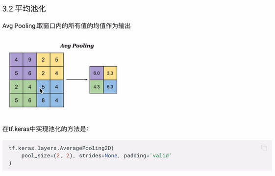
### 1.3 全连接层
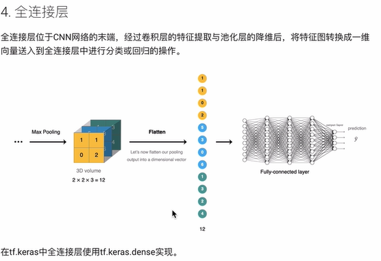
### 1.4 卷积神经网络的构建
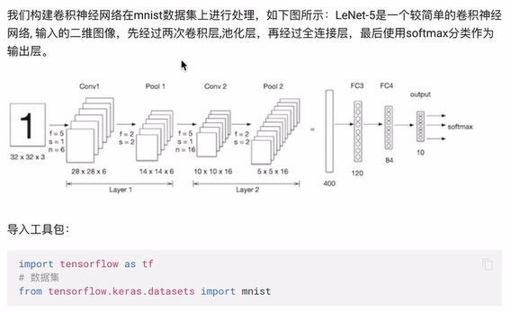
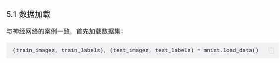
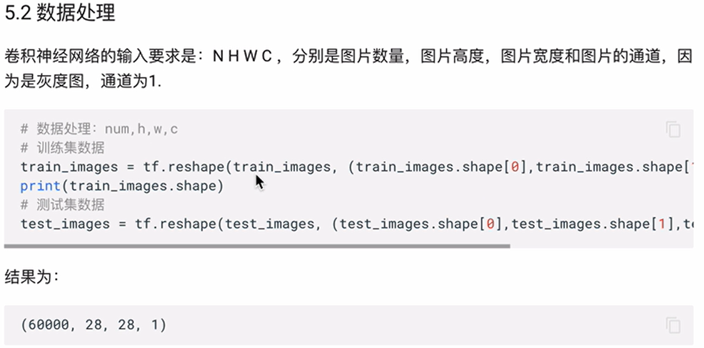
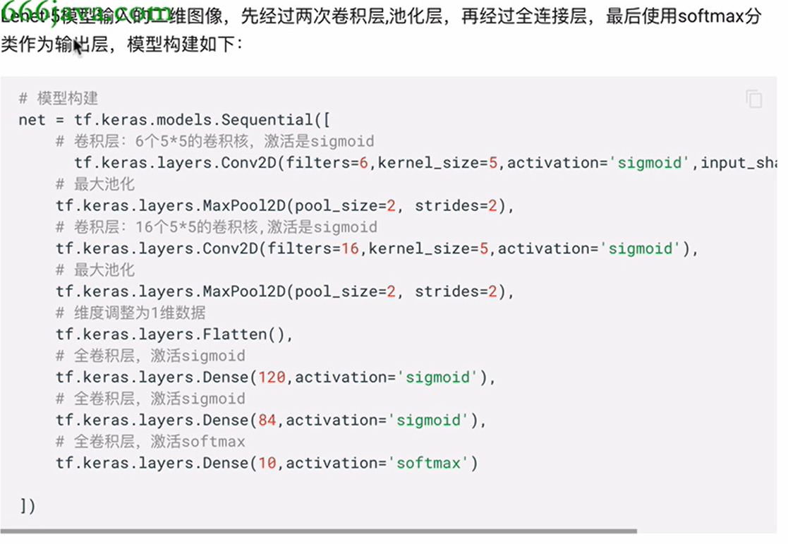
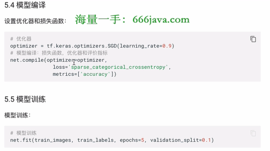
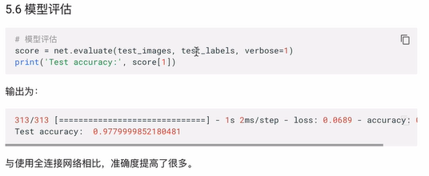